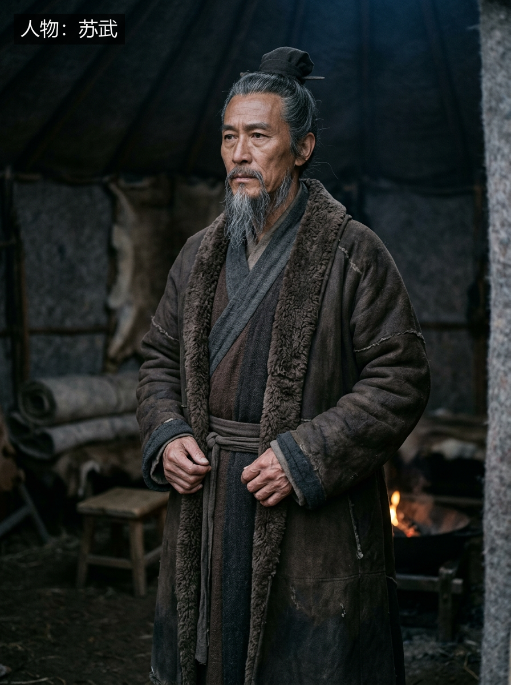
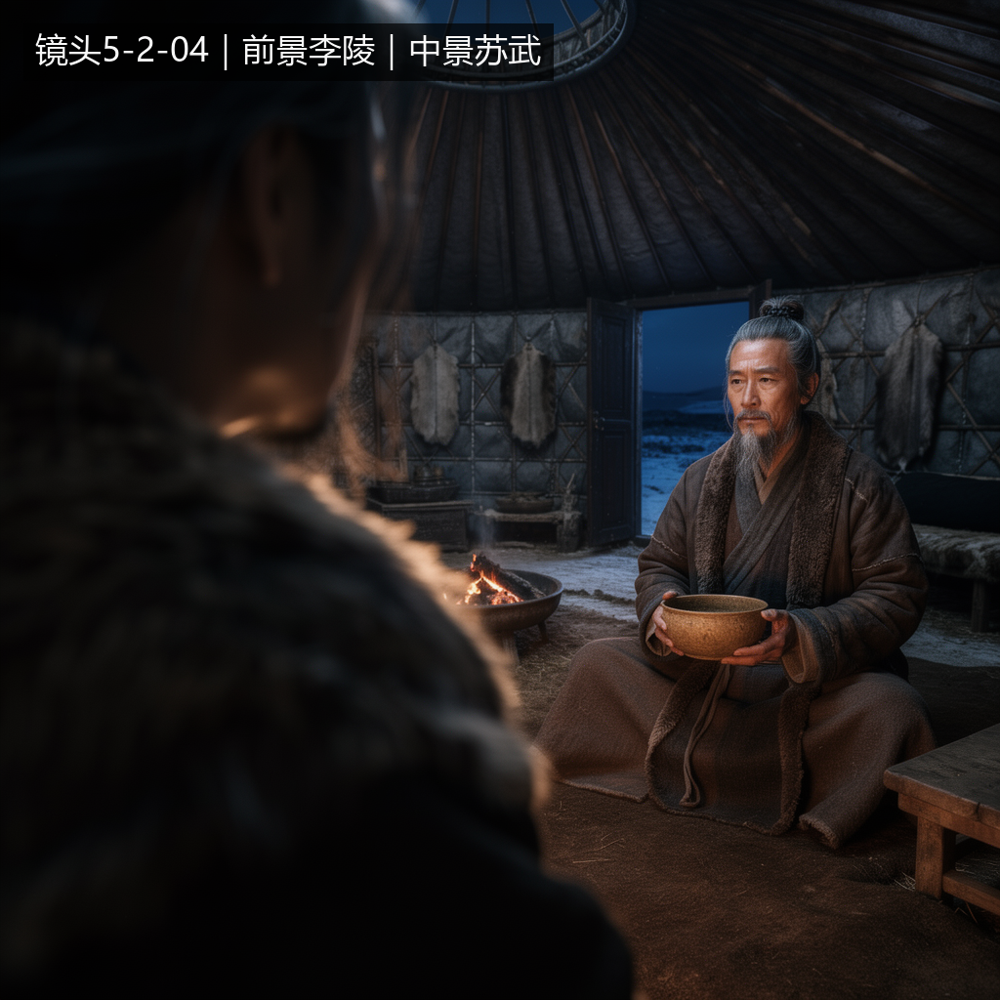
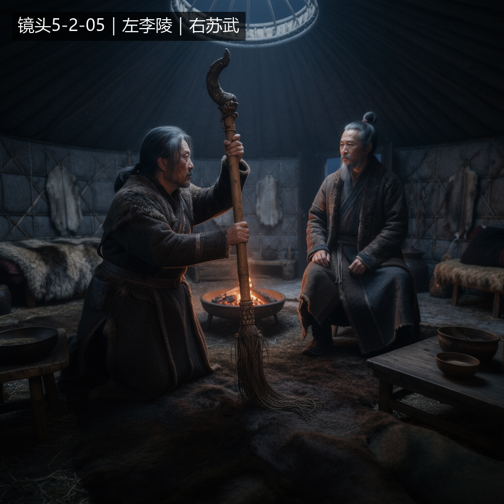
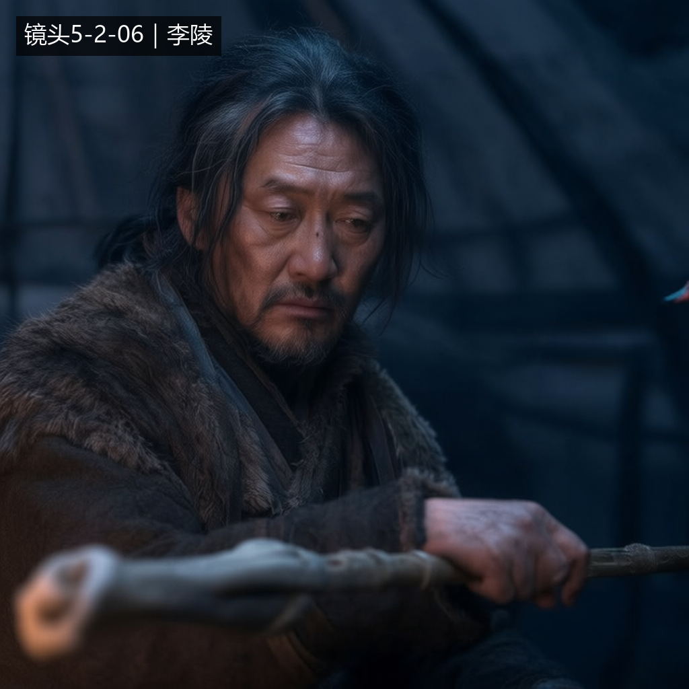

# Batch 5.4.2 — Visual Provider Retry Policy Finalization & Production Resume 执行报告

执行日期：2026-08-17  
执行 Host：Windows  
范围：Visual Provider Retry Policy 一次性收口；恢复 Scene `5-2 一桌家书` 的苏武 Master 与 Shot `5-2-04` / `5-2-05` / `5-2-06` 图片生产。未生成视频或音频。

## 1. Executive Summary

Batch 5.4.2 **PASS**。

Visual Provider 的有限技术重试已收口为一份正式 Skill Core 规则：`skills/shot-production/references/visual-provider.md`。`shot-production` 继续直接加载该 reference；`asset-resolution` 只引用它，没有复制第二份 Retry 实现。规则冻结为每个独立 Provider operation 的 initial attempt + 最多 2 次 technical retry，并按 initialize、upload、submit、status、get_output、download 定义幂等边界。Technical Retry、OAuth recovery、Visual Review 与 targeted revise 使用互相独立的计数和语义。

离线回归包含要求的 9 个 Retry 决策样例，完整 `test_skills.py` 结果为 `34 passed`。两个消费者 Skill 均通过 `quick_validate.py`。更新后的 Plugin 已通过正式 marketplace 安装路径生效，版本为 `0.1.0+codex.20260817125352`。

生产主线已经恢复并完成：

- Comfy Cloud 首次 preflight 的 HTTP 502 按新规则重试一次后 PASS；`generationCount` 保持 0。
- Skill 已发现的 `MISSING_STABLE_REFERENCE = 苏武` 继续由 `asset-resolution` 处理。苏武 Master 首次生成 PASS、Visual Review PASS、Identity Annotation PASS、Media/Asset Persistence PASS。
- Shot A/B/C 均使用 Skill 已编译的 Reference Plan、Sequence Context 与 Shot Delta；每个 Shot 只生成 1 次，全部首次 Visual Review PASS，因此没有为了流程完整而 revise。
- Cross-Shot Review 对 Character Identity、Age、Hair/Beard、Costume、Scene、Lighting 与 Prop State 全部 PASS。
- 三个新 Shot Media 均完成 `import → get → resolve → SHA-256 equality`，当前 Host 新 Media 字节一致性 PASS。

历史李陵与穹庐 Media 在当前 Windows Local MinIO 仍不可用，继续使用经 Shared MySQL `contentHash` 证明的 `TRUSTED_ARTIFACT_FALLBACK`。没有为此建设同步、replica 或新存储架构。

## 2. Retry Policy Implementation

### 2.1 Single source

唯一主规则：

```text
skills/shot-production/references/visual-provider.md
```

正式冻结：

```text
MAX_TECHNICAL_RETRIES = 2
MAX_TOTAL_ATTEMPTS = 3
```

每个独立 Provider operation 使用自己的 bounded budget；不会因 status、output 或 download 分别重试而重新开始 production loop。

### 2.2 Referencing consumer Skills

- `shot-production`：既有正式消费者，直接加载 `references/visual-provider.md`。
- `asset-resolution`：新增对同一文件 `../shot-production/references/visual-provider.md` 的引用；没有复制 Retry 分类或幂等规则。
- 当前仓库没有第三个已正式直接执行视觉 Provider 调用、且需要本批修改的生产 Skill；未改写非消费者 Skill。

### 2.3 Error classes

`RETRYABLE_PROVIDER_ERROR` 包括无明确永久失败证据的 502/503/504/429、连接 reset/timeout、临时 TLS 中断、MCP initialize/discovery、upload、same-job status/wait、same-job output fetch 与 output download 的瞬时失败。429 在 budget 内优先遵守 `Retry-After`。

以下不做 technical retry：invalid argument/tool input、unsupported reference count/template、contract validation、missing Asset/Media/stable reference、hash mismatch、content/safety rejection、明确永久 4xx、Visual Review FAIL、Cross-Shot Review FAIL。

OAuth 被分类为 `PROVIDER_AUTH_REQUIRED`，最多一次官方 recovery；不占 technical retry budget。

### 2.4 Idempotency and counters

- preflight/discovery：重试同一无消费 operation。
- upload：保持同一 artifact、相同 hash、相同 Reference Plan。
- submit：只有明确 `no job created` 才允许重试；结果未知时先 recovery，禁止盲目二次 submit。
- status/wait：始终复用同一 `jobId`。
- get_output：始终复用同一 completed `jobId`；signed URL 过期只刷新 URL。
- download：重试同一 generated output，不重新生成。

```text
technicalRetryCount != generationCount
technicalRetryCount != targeted revise
```

实际执行中，Provider schema 的两次输入校验失败都在 inference 前 fail closed，分别记录为 `contractRejectedSubmit`，没有被伪装成 technical retry、Visual Review FAIL 或真实 generation。

## 3. Retry Tests

Fixture：`tests/fixtures/visual-provider-retry-policy.yaml`  
Tests：`tests/test_skills.py`

| # | Case | Expected decision | Result |
|---|---|---|---|
| 1 | initialize: 502 → PASS | retry 1；technical=1；generation=0；continue | PASS |
| 2 | initialize: 502 → 502 → 502 | 3 attempts 后 `VISUAL_PROVIDER_TEMPORARILY_UNAVAILABLE` | PASS |
| 3 | existing job status: 502 → PASS | same jobId；no new submit | PASS |
| 4 | completed job get_output: 503 → PASS | same jobId；generation unchanged | PASS |
| 5 | signed URL expired | fresh get_output；no regeneration | PASS |
| 6 | submit outcome unknown | no blind resubmit；`PROVIDER_SUBMISSION_OUTCOME_UNKNOWN` | PASS |
| 7 | Visual Review FAIL | no technical retry；targeted revise | PASS |
| 8 | MISSING_STABLE_REFERENCE | no technical retry；asset-resolution | PASS |
| 9 | OAuth required | no technical retry；OAuth recovery <= 1 | PASS |

执行结果：

```text
python -m pytest plugin/tests/test_skills.py -q
34 passed in 0.57s

quick_validate asset-resolution = PASS
quick_validate shot-production = PASS
installed plugin version = 0.1.0+codex.20260817125352
```

## 4. Provider Resume

### 4.1 Preflight

```text
Comfy Cloud MCP registered = PASS
get_server_info = PASS
server = comfyui-cloud
environment = production
OAuth = authenticated
tool count = 40
```

恢复轨迹：

```text
remote MCP initialize attempt 1 = HTTP 502
technical retry #1              = PASS
technicalRetryCount             = 1
generationCount                 = 0
PROVIDER_PREFLIGHT_FINAL        = PASS
```

生产过程中真实出现一次 `invalid_grant / refresh token reuse detected` 并最终返回 `Auth required`。按独立 OAuth 规则执行本批唯一一次官方 `codex mcp login comfy-cloud`，随后只重试原模板预检；恢复 PASS。OAuth recovery 没有计入 technical retry。

苏武上传 URL 获取曾返回一次明确 temporary account-access error；同一文件、相同 hash、相同 Reference Plan 的 retry #1 PASS。该事件记为 shared Reference Upload `technicalRetryCount = 1`，没有增加任何视觉 target 的 generationCount。

### 4.2 Submit safety evidence

- 两次付费 Flux 调用在 confirmation 不可用时明确返回 `NOT PERFORMED / no credits spent`，所以在用户明确授权 credits 后可安全重新调用；不是 outcome unknown。
- 每个真实 submit 都先取得唯一 `prompt_id`，后续只对相同 job 查询 status 与 get_output。
- Qwen template schema 的错误 proxy mapping 造成两个 400 validation job；错误证据明确为 `prompt_outputs_failed_validation`，没有 inference output。它们作为 non-retryable contract rejection 记录，不计入 technical retry 或 generationCount；随后选择已发现且符合 Reference 数量的正式模板输入方式。

## 5. Su Wu Reference

`shot-production` 在 Batch 5.4 自主得到：

```text
MISSING_STABLE_REFERENCE = 苏武
```

本批沿用该 Skill checkpoint，未由 Host 重新手写“生成苏武 Reference”。`asset-resolution` 执行：

```text
search-before-create
→ asset.search_assets(name=苏武, type=MASTER_CHARACTER_CARD) = []
→ reference generation
→ Visual Content Review PASS
→ no targeted revise
→ Identity Annotation
→ media.import_media
→ media.get_media
→ media.resolve_media
→ SHA-256 equality
→ asset.create_asset
```

结果：

```text
Provider jobId = e901c32b-ef09-4157-8737-2e362b214b62
technicalRetryCount = 0
generationCount = 1
provider artifact SHA-256 = 8077dc788bbfff2488d35cb39a086b3ce65a1886f60674adb4abd148027068ae
annotated artifact SHA-256 = a18b84b4703cec7ac0602d4ad5872bd9e17a9b8c53c09451beaeba226228c12b
mediaId = media_945361aca6954fe6bfe7b5cea94a9ced
assetId = asset_0e367cfbb4594d3cbf34f1b88c5cfc7f
reference source mode = NEW_STABLE_REFERENCE
```

Visual Review：单一成熟/年长汉使，清瘦风霜脸、灰黑束发与长须、深色汉式叠穿和粗皮毛，手部结构正常，穹庐/弱火环境历史感成立；无现代或奇幻元素。首次 PASS。

Media resolve 下载 SHA-256 与 identity-annotated artifact 同为：

```text
a18b84b4703cec7ac0602d4ad5872bd9e17a9b8c53c09451beaeba226228c12b
```



## 6. Host Prompt and Final Reference Planning

真正启动 Skill 的 Host 业务 Prompt 保持为：

> 继续制作 Scene `5-2 一桌家书` 的连续镜头 `5-2-04`、`5-2-05`、`5-2-06`。  
> 使用 historical-plugin 的正式 Skill 自主完成必要的资产解析、Reference Planning、连续性控制、镜头生产、质量审查、必要修订和 Media 持久化。  
> 不生成视频。

### Shot A — 5-2-04

```text
visible entities = 李陵、苏武、苏武穹庐、碗
candidates = 李陵 Master、苏武 Master、穹庐 Scene Master
selected = 李陵、苏武、穹庐
omitted = 碗（不建立独立长期 Reference）
actual reference count = 3
source modes = TRUSTED_ARTIFACT_FALLBACK / NEW_STABLE_REFERENCE / TRUSTED_ARTIFACT_FALLBACK
```

### Shot B — 5-2-05

```text
visible entities = 李陵、苏武、汉节、苏武穹庐、碗
candidates = 李陵 Master、苏武 Master、穹庐 Scene Master；汉节无 Stable Reference
selected = 李陵、苏武、穹庐
omitted = 汉节（非角色门禁；文字约束足够）、碗（连续道具状态，不建立独立 Reference）
actual reference count = 3
source modes = TRUSTED_ARTIFACT_FALLBACK / NEW_STABLE_REFERENCE / TRUSTED_ARTIFACT_FALLBACK
```

### Shot C — 5-2-06

```text
visible entities = 李陵、苏武穹庐；汉节局部
candidates = 李陵 Master、穹庐 Scene Master
selected = 李陵、穹庐
omitted = 苏武（画外）、汉节（局部连续道具）
actual reference count = 2
source modes = TRUSTED_ARTIFACT_FALLBACK / TRUSTED_ARTIFACT_FALLBACK
```

没有为了填满 3 张给 Shot C 加入苏武或重复 Reference。

## 7. Sequence Continuity and Shot Delta

### Locked Facts

- 李陵：同一中年身份、脸型、散发/短须、深色胡服与皮毛轮廓。
- 苏武：同一成熟/年长身份、风霜脸、灰黑发须、深色汉式叠穿与粗皮毛。
- Scene：同一圆形毡帐内部、历史皮毛/木质材料与主要空间身份。
- Lighting：冷暗入夜、弱火暖光、低曝光。
- Props：同一只碗的连续状态；同一残损汉节及穗状残件。

### Allowed Delta

姿态、视线、表情、身体方向、自然衣褶、不同景别/机位带来的背景可见量与尺度变化。

### Shot-specific Delta and Prop State Transition

```text
5-2-04: bowl = HELD_BY_SU_WU / used_for_warmth / not drinking
    ↓
5-2-05: bowl = ON_LOW_TABLE / Su Wu hands = FREE / Li Ling supports Han staff
    ↓
5-2-06: bowl = remains off close framing / Li Ling hand paused on Han staff
```

Shot A 的 Delta Compilation 实际进入 Provider 的约束包括：

| Compiler field | Compiled constraint |
|---|---|
| source semantics | 苏武只暖手不饮；双人过肩；静态机位 |
| required evidence | 双手持碗；碗口低于下唇；碗口与嘴有可见间隙；李陵前景肩背明确可见 |
| forbidden outcome | 嘴碰碗、喝/啜饮、缺少过肩前景、现代或奇幻物件 |
| composition constraint | 李陵前景肩背框景，苏武中景，双人空间关系成立 |
| static camera intent | 固定过肩构图与景深层次，不把动作改写为饮用 |

## 8. Shot A — 5-2-04

```text
Provider template = api_bfl_flux2_max_sofa_swap（Flux2Max general 3-image node）
jobId = f8a5af3f-c91e-48d8-8055-2dd24b3b1aef
technicalRetryCount = 0
generationCount = 1
targeted revise = 0
references = 3
Visual Content Review = PASS
Identity Annotation = PASS
mediaId = media_bc0f7ff0082140178ef8fb2b4710a8eb
```

实际画面证据：李陵以前景肩背建立清晰过肩关系；苏武在中景双手捧碗；碗口明显低于下唇且存在可见间隙；没有嘴碰碗或饮用；人物、服装、穹庐、冷夜弱火光和结构质量均合格。首次 PASS，按规则停止。

```text
provider SHA-256 = 4027cd8566671f69a7bce5f3b738b8b13fac8fcfd977959115be42b44442a86d
annotated/resolved SHA-256 = a7b59e8d4e1e6e8dba07d258b9307ec41122c2fbe4611ce7c897b134eeba1dc1
```



## 9. Shot B — 5-2-05

```text
Provider template = api_bfl_flux2_max_sofa_swap
jobId = b323f44c-1a73-429a-bd8c-35606a2b996f
technicalRetryCount = 0
generationCount = 1
targeted revise = 0
references = 3
Visual Content Review = PASS
Identity Annotation = PASS
mediaId = media_aaf5683834d4429fa5531edbf2efbaa8
```

实际画面证据：李陵与苏武身份/年龄/发式/服装连续；李陵双手扶持残损长节， aged shaft 与穗状残件清晰；苏武双手已空出；碗位于右侧矮桌且无人手持；同一穹庐与冷夜弱火光成立。首次 PASS，未 revise。

```text
provider SHA-256 = e957aade57570a2752393d623fe727133a6815cd1bb1de7bc17cc2e51dc32f98
annotated/resolved SHA-256 = 82aedd15cff97064890ad5be031af2c5a11d949fdef7d62cb920360ee0cd56d4
```



## 10. Shot C — 5-2-06

```text
Provider template = image_qwen_image_edit_2511
jobId = 33823ebd-bb03-4db5-b6ab-0245072728a0
technicalRetryCount = 0
generationCount = 1
targeted revise = 0
references = 2
Visual Content Review = PASS
Identity Annotation = PASS
mediaId = media_5cde5338c6ba4b26aa643ae6fc22ea40
```

实际画面证据：李陵正面/三分之四近景、身份和深色皮毛服装稳定；手停在汉节上；视线偏向画外苏武，形成克制反问状态；同一冷暗穹庐光线成立；没有苏武、王印、碗、饮用或现代元素。简单 Shot 首次 PASS 后立即停止。

```text
provider SHA-256 = fba88eff2b63be274c551bcffff8d1699f0f76f06e558801a7275346c5db987a
annotated/resolved SHA-256 = bedbd4589b6a475ab68900d8bb33d72376813c19a981ddb0884c3b3df58900d7
```



## 11. Cross-Shot Review

前置条件满足：A/B/C 的 Per-Shot Visual Content Review 全部 PASS。

| Dimension | Locked/Allowed distinction | Result |
|---|---|---|
| Character Identity | 李陵 A 为合法过肩轮廓，B/C 的脸、散发短须和服装稳定；苏武 A/B 的风霜脸、灰黑发须稳定 | PASS |
| Age | 李陵保持中年风霜感；苏武保持成熟/年长 | PASS |
| Hair / Beard | 李陵散发短须；苏武灰黑束发与长须 | PASS |
| Costume | 两人各自深色历史叠穿/皮毛主轮廓连续 | PASS |
| Scene | 同一圆形毡帐、皮毛墙面与低矮木具；近景背景可见量变化属于 Allowed Delta | PASS |
| Lighting | 冷暗夜色、弱暖火边光和低曝光连续 | PASS |
| Prop State | A 碗在苏武双手；B 碗在矮桌且双手释放、李陵扶节；C 近景碗合法出画、手仍在节上 | PASS |

三张图没有被要求像素级相同；过肩、物件双人中景、正面近景是正式 Shot-specific Delta，不是 drift。

## 12. Media Persistence

Identity Annotation 顺序保持：

```text
Provider Output
→ Visual Content Review PASS
→ deterministic Identity Annotation
→ media.import_media
→ media.get_media
→ media.resolve_media
→ SHA-256 equality
```

| Target | mediaId | Import | Get | Resolve | Local vs resolved SHA-256 |
|---|---|---|---|---|---|
| 苏武 Master | `media_945361aca6954fe6bfe7b5cea94a9ced` | PASS | PASS | PASS | EQUAL |
| 5-2-04 | `media_bc0f7ff0082140178ef8fb2b4710a8eb` | PASS | PASS | PASS | EQUAL |
| 5-2-05 | `media_aaf5683834d4429fa5531edbf2efbaa8` | PASS | PASS | PASS | EQUAL |
| 5-2-06 | `media_5cde5338c6ba4b26aa643ae6fc22ea40` | PASS | PASS | PASS | EQUAL |

当前 Windows Local MinIO 对本批新 Media 正常工作。历史 Stable Media 的 Host-local 404 没有阻止新 Media 持久化。

## 13. Scope Control and Changed Files

### Source changes

- `plugin/skills/shot-production/references/visual-provider.md`：唯一 Retry Policy 主规则。
- `plugin/skills/asset-resolution/SKILL.md`：引用同一规则。
- `plugin/tests/fixtures/visual-provider-retry-policy.yaml`：9 个离线决策样例。
- `plugin/tests/test_skills.py`：single-source/consumer/decision tests。
- `plugin/.codex-plugin/plugin.json`：cachebuster 版本更新。
- `plugin/docs/reports/artifacts/batch5-4-2/annotate_identity.py`：本批轻量确定性身份标注工具；未形成 framework。

### Explicit non-changes

```text
Java = unchanged
Drama MCP = unchanged
Database schema/data structure = unchanged
new runtime service = none
retry framework/scheduler/database = none
MinIO sync/replica/migration = none
video/audio = none
other Scene/Episode production = none
```

环境 fallback：李陵与穹庐继续使用 `TRUSTED_ARTIFACT_FALLBACK`；苏武使用 `NEW_STABLE_REFERENCE`。这不被表述为当前 Host Stable Media resolve PASS。

## 14. Unified Acceptance Fields

```text
VISUAL_PROVIDER_RETRY_POLICY = PASS
RETRY_POLICY_SINGLE_SOURCE = PASS

ASSET_RESOLUTION_RETRY_POLICY = PASS
SHOT_PRODUCTION_RETRY_POLICY = PASS

MAX_TECHNICAL_RETRIES = 2

RETRYABLE_ERROR_CLASSIFICATION = PASS
NON_RETRYABLE_ERROR_CLASSIFICATION = PASS

TECHNICAL_RETRY_SEPARATE_FROM_VISUAL_REVISE = PASS
GENERATION_COUNT_SEPARATE_FROM_TECHNICAL_RETRY = PASS

JOB_STATUS_SAME_JOB_RETRY = PASS
GET_OUTPUT_SAME_JOB_RETRY = PASS
SIGNED_URL_REFRESH_WITHOUT_REGENERATION = PASS

UNKNOWN_SUBMISSION_DUPLICATE_PROTECTION = PASS
OAUTH_RECOVERY_SEPARATE = PASS

RETRY_POLICY_TESTS = PASS

COMFY_CLOUD_MCP_REGISTERED = PASS
PROVIDER_PREFLIGHT_INITIAL = FAIL

PROVIDER_PREFLIGHT_TECHNICAL_RETRY_COUNT = 1
PROVIDER_PREFLIGHT_FINAL = PASS

SU_WU_REFERENCE_DISCOVERED_MISSING_BY_SKILL = YES
ASSET_RESOLUTION_TRIGGERED_BY_SKILL = YES

SU_WU_MASTER_GENERATION = PASS
SU_WU_MASTER_TECHNICAL_RETRY_COUNT = 0
SU_WU_MASTER_GENERATION_COUNT = 1
SU_WU_MASTER_VISUAL_REVIEW = PASS
SU_WU_MASTER_MEDIA_PERSISTENCE = PASS
SU_WU_MASTER_ASSET_PERSISTENCE = PASS

REFERENCE_PLANNING_AUTONOMOUS = YES
REFERENCE_MAX_COUNT_COMPLIANT = PASS
REFERENCE_REUSE_ACTUALLY_USED = YES

SHOT_A_ACTUAL_REFERENCE_COUNT = 3
SHOT_B_ACTUAL_REFERENCE_COUNT = 3
SHOT_C_ACTUAL_REFERENCE_COUNT = 2

SHOT_A_TECHNICAL_RETRY_COUNT = 0
SHOT_B_TECHNICAL_RETRY_COUNT = 0
SHOT_C_TECHNICAL_RETRY_COUNT = 0

SHOT_A_GENERATION_COUNT = 1
SHOT_B_GENERATION_COUNT = 1
SHOT_C_GENERATION_COUNT = 1

SHOT_A_VISUAL_CONTENT_REVIEW = PASS
SHOT_B_VISUAL_CONTENT_REVIEW = PASS
SHOT_C_VISUAL_CONTENT_REVIEW = PASS

REVIEW_REVISE_SKILL_DRIVEN = YES

CROSS_SHOT_VISUAL_CONSISTENCY = PASS

SHOT_A_MEDIA_PERSISTENCE = PASS
SHOT_B_MEDIA_PERSISTENCE = PASS
SHOT_C_MEDIA_PERSISTENCE = PASS

CURRENT_HOST_NEW_MEDIA_BYTE_EQUALITY = PASS

NEW_RETRY_FRAMEWORK_INTRODUCED = NO
NEW_RUNTIME_SERVICE_INTRODUCED = NO
NEW_DATABASE_STRUCTURE = NO

MINIO_SYNC_SYSTEM_INTRODUCED = NO

DRAMA_PLUGIN_BUSINESS_SOURCE_CHANGED = YES
DRAMA_MCP_CHANGED = NO
JAVA_CHANGED = NO
DATABASE_CHANGED = NO

BATCH_5_4_2 = PASS
BATCH_5_4_RESUMED = YES
NEXT_BATCH_READY = YES
```

`DRAMA_PLUGIN_BUSINESS_SOURCE_CHANGED = YES` 仅指本任务明确要求的 Skill Core Retry Policy 与消费者引用发生正式变更；没有修改 Shot 业务事实以迎合生成结果。

## 15. Final Answer

Batch 5.3 加固后的 `shot-production` 已在 Host 只提供简短业务目标时完成真实连续镜头生产。它自主继承并执行了 Reference Planning、缺失业务 Reference 协作、Sequence Continuity、Shot Delta Compilation、Per-Shot Review、是否 revise 的门禁、Cross-Shot Review、Identity Annotation 与 Media Persistence。

Visual Provider 瞬时错误现在由一份有限、分类、幂等安全的通用 Skill 规则处理；502 不再第一次失败就终止，但 submit outcome unknown 也不会被盲目重复收费。生产主线已恢复并完成，本批到此停止。
