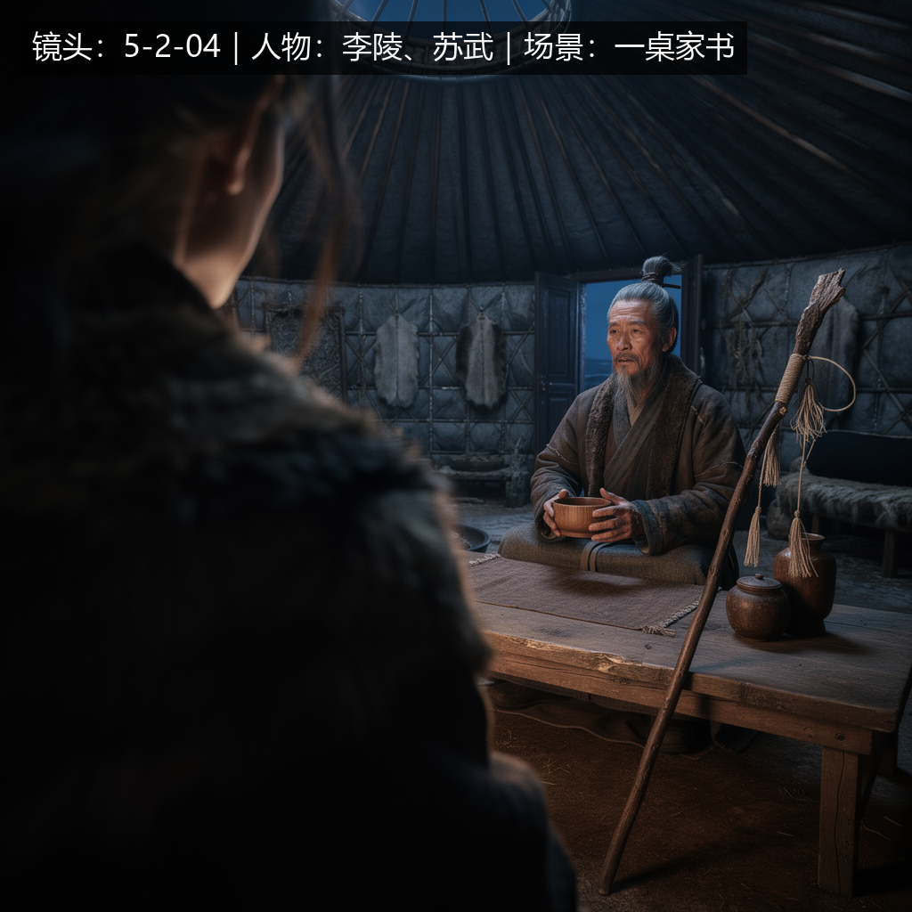
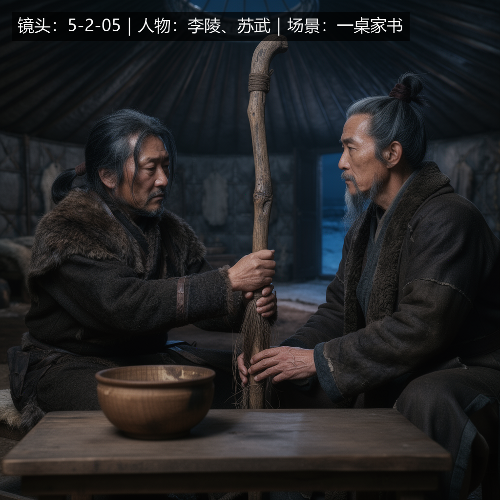
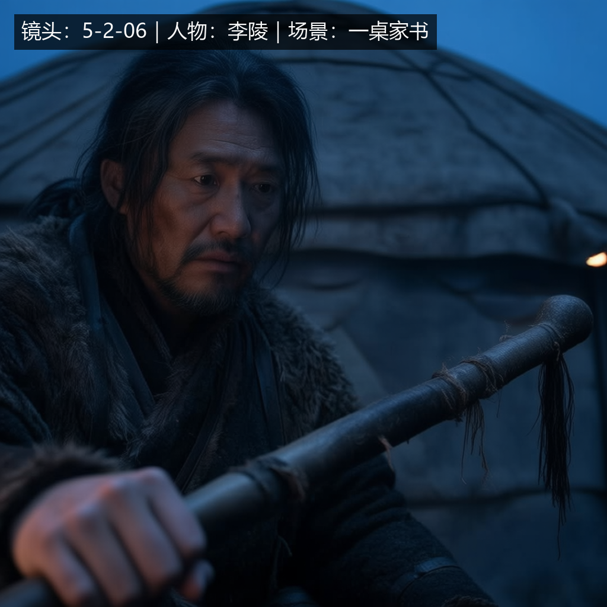

# Batch 5.5：Scene-Level 扩大真实视觉生产验证执行报告

## 1. 执行结论

Batch 5.5 已完成并通过。正式 `shot-production` Skill 在 Host 仅给出 Scene 级生产目标的前提下，从现有 Scene `5-2 一桌家书` 中自主选择连续镜头 `5-2-04 / 05 / 06`，完成 Scene/Shot 上下文发现、稳定资产解析、逐镜头 Reference Planning、连续性控制、真实 Comfy Cloud 生成、单镜头视觉审查、跨镜头审查、身份标注以及 Media 持久化。

- 实际生成镜头：3 个。
- Provider 真实生成：3 次；全部首轮视觉审查 PASS，targeted revise 为 0 次。
- Reference 上限：A=3、B=3、C=2，全部不超过 3；没有为了填满配额加入无关 Reference。
- 新 Shot Media：3 个，均完成 `import → get → resolve → SHA-256 equality`。
- Scene-Level Cross-Shot Review：PASS。
- 本批未生成视频或音频，未修改 Java、Drama MCP、Skill Core、数据库结构或存储架构。

## 2. 真实业务对象与发现结果

| 对象 | ID / 数量 | 结果 |
|---|---|---|
| Work | `work_4cf81e8862234727b082cf2115ec699b` | PASS |
| Script | `script_5f16ca3b7a3b4b2e80b2f2711e37b2ce` | PASS |
| Episode | `episode_3a900d6a26b246889970af5b7f5a1475` | PASS |
| Scene | `scene_399ace55923e47be8092eb808d7d284c`，`5-2 一桌家书` | PASS |
| Scene 下正式 Shot | 10 个 | PASS |
| 本批连续生产 Shot | 3 个 | PASS |
| Scene Context | `drama:scene:scene_399ace55923e47be8092eb808d7d284c`，version 1 | PASS |

执行了 `context.build_context(scope=SCENE, purpose=SHOT_PRODUCTION)`。其他已有 Scene 当时未发现正式 Shot，因此本批复用内容完整且具有连续镜头的 `5-2`，没有为凑数量创建无意义业务实体。

## 3. Scene 共享上下文与连续性

Skill 建立并贯穿三个镜头的 Sequence Context：

**Locked Facts**

- 李陵：中年，长黑发、短须，深色皮裘。
- 苏武：年长，灰发灰须，破旧汉服与皮裘。
- 场景：同一圆形毡制穹庐；寒夜；火盆提供弱暖光。
- 汉节：破旧长杆，仅剩少量旄毛纤维。

**Allowed Delta**

- 景别、机位、焦点、人物姿态与表情可随叙事变化。
- 近景中背景可减少；`5-2-06` 可比前两镜更冷、更暗。

**Shot-specific Delta / Prop State Transition**

1. `5-2-04`：苏武双手持碗取暖，碗不接触嘴，不饮；李陵前景肩背构成双人过肩。
2. `5-2-05`：碗已放至矮桌，苏武双手释放；李陵扶住汉节。
3. `5-2-06`：李陵正面近景反问，手仍停在汉节；碗处于近景画外，不制造新的碗状态。

## 4. 资产与 Media 解析

| 实体 | Asset ID | Media ID | 本批 Provider 来源 | 证明 |
|---|---|---|---|---|
| 李陵 | `asset_df44cfb7db1646f2a7b7eae2463a032e` | `media_fe9dae51b9a74c8ea4819784eca27154` | `TRUSTED_ARTIFACT_FALLBACK` | 本地已审查 Artifact SHA-256 与 Shared MySQL `contentHash` 同为 `742bd90ef8d5da24be3c1037b386079fe3d8d6cb6869b5b5d5a81c9b41bfa51d` |
| 苏武 | `asset_0e367cfbb4594d3cbf34f1b88c5cfc7f` | `media_945361aca6954fe6bfe7b5cea94a9ced` | `STABLE_MEDIA` | 当前 Host resolve PASS；SHA-256 `a18b84b4703cec7ac0602d4ad5872bd9e17a9b8c53c09451beaeba226228c12b` |
| 苏武穹庐 | `asset_c13dbef904f04c63bc48de0a8505be66` | `media_ec444a5cf36040bcb96b2b12b8a6ea6e` | `TRUSTED_ARTIFACT_FALLBACK` | 本地已审查 Artifact SHA-256 与 Shared MySQL `contentHash` 同为 `5e0eddccf35284a98ba79087abed64ceb539614aab308138fa151f45f0b8eb71` |

李陵与穹庐的历史 Media metadata 存在，但当前 Windows Local MinIO 的旧物理对象不可用；本批按既定测试环境规则使用 hash 相等的 Trusted Artifact，没有创建重复 Stable Asset，也没有建设同步或副本系统。苏武 Stable Media 在当前 Host 可直接 resolve。

## 5. 逐镜头 Reference Planning

| Shot | 可见核心实体 | Selected Reference | Omitted / 理由 | 实际数量 |
|---|---|---|---|---:|
| A `5-2-04` | 李陵、苏武、穹庐 | 李陵角色、苏武角色、穹庐场景 | 无；三者均直接约束画面 | 3 |
| B `5-2-05` | 李陵、苏武、汉节、穹庐 | 李陵角色、苏武角色、穹庐场景 | 汉节没有独立稳定 Reference；以 Shot/Scene 语义约束，不突破上限 | 3 |
| C `5-2-06` | 李陵、穹庐；苏武画外 | 李陵角色、穹庐场景 | 苏武不可见，省略并记录理由，不补满第三张 | 2 |

所有 Reference 都以实体名、Asset ID、Media ID 和用途传入；没有匿名引用，Reference Count 上限 3 生效。经用户明确授权，本批所需 Reference 上传到 Comfy Cloud，仅用于本批正式生成。

## 6. Shot 生产结果

| Shot | Shot ID | Provider / Job | 技术重试 | Generation Count | Review | Revise | Media ID |
|---|---|---|---:|---:|---|---:|---|
| `5-2-04` | `shot_a9dc0ba7dfdc4e7ea2d1d479403c6274` | Flux2Max / `b0578694-8aba-46d3-be3a-3a7a7b2c55ec` | 0 | 1 | PASS | 0 | `media_bd382552bfc94719b6e2b2dffa00583c` |
| `5-2-05` | `shot_5559407312e04d9988591a11d3bcbf7f` | Flux2Max / `056148f5-25b9-40f5-8c14-a4ff5b3a0fd2` | 0 | 1 | PASS | 0 | `media_1dc175f213cc474598efbed9bc909f30` |
| `5-2-06` | `shot_11b46c83ee77483fb01c6903cfa198c3` | Qwen Image Edit / `b7bc326f-a54b-46e5-8383-7191a8d5b577` | 0 | 1 | PASS | 0 | `media_fe91350a6e6247188adcda7c71d1b696` |

### Shot A — `5-2-04`

Shot Delta Compilation 将“只暖手不饮”编译为可检查的视觉证据：双手持碗、碗口与下唇有清楚间隙；禁止嘴碰碗或饮用；构图要求李陵前景肩背与苏武中景形成双人过肩；静态机位。Provider 输出满足以上约束，人物、服装、穹庐、弱暖光和结构质量均 PASS。



### Shot B — `5-2-05`

画面正确表现李陵扶节，苏武位于关系构图另一侧；碗已在桌上且不再由苏武持有，完成 A→B 的 Prop State Transition。汉节造型略偏粗朴，但“破旧长杆、残余旄毛、扶节动作”的业务语义成立，不构成确认的视觉语义失败，因此按 Skill 规则不主动抽卡 revise。



### Shot C — `5-2-06`

李陵正面三分之四近景反问，手停在汉节，苏武位于画外；李陵身份、年龄、发须和服装保持稳定。碗不进入紧近景，符合状态延续。首轮 PASS 后立即停止，没有为了流程完整触发 revise。



## 7. Provider、Retry 与计数边界

- Comfy Cloud MCP preflight 与正式生成均 PASS。
- 三个视觉 Target 均只提交一次真实 Generation，总 Provider Generation Count = 3。
- `wait_for_job` 的正常 `timed_out` 表示轮询窗口结束；后续均对同一 jobId 继续等待，没有重新 submit，不计 technical retry，也不增加 generation count。
- 没有发生 502/503/504、连接错误或 output fetch 瞬时失败，实际 Technical Retry Count = 0。
- `5-2-05` 在用户再次确认付费前的一次 spend gate 返回 `NOT PERFORMED / no credits spent`，没有创建 job，不计 Generation 或 Technical Retry；确认后只提交了上表中的一次正式 job。
- 离线契约测试覆盖：bounded retry、同 job status/output retry、signed URL refresh 不重生成、unknown submit 不盲目重提、OAuth 与 technical retry 分离、Visual Review FAIL 走 targeted revise、Missing Stable Reference 走业务解析。

## 8. Per-Shot 与 Cross-Shot Review

三个 Provider 原图都被实际打开审查，且审查发生在身份标注之前。

| 维度 | 结论 | 证据摘要 |
|---|---|---|
| Character Identity | PASS | 李陵在 B/C 的五官、年龄、长黑发短须一致；A 为合法前景肩背；苏武在 A/B 的灰发长须与年龄一致 |
| Costume | PASS | 李陵深色皮裘、苏武旧汉服皮裘连续 |
| Scene | PASS | 同一圆形毡制穹庐、火盆弱暖光与寒夜材质连续；C 的更紧景别和偏冷色属于 Allowed Delta |
| Lighting | PASS | A/B 火盆暖光连续，C 仍保留同场景低照度，冷暗变化服务反问语义 |
| Prop State | PASS | 碗由 A 手持取暖变为 B 放桌，再在 C 近景画外；汉节由 B 扶住延续至 C 手停节上 |
| Reference Correctness | PASS | 每张图的角色和场景身份与所选 Reference 相符，无错误实体替换 |
| Structural Quality | PASS | 人体、手部、关系构图可用；B 的汉节粗朴仅记为模型质量观察 |

Cross-Shot Review 在三个 Per-Shot Review 全部 PASS 后执行，最终 `CROSS_SHOT_VISUAL_CONSISTENCY = PASS`。

## 9. Identity Annotation 与 Media Persistence

严格执行冻结顺序：

`Provider Output → Visual Content Review PASS → deterministic Identity Annotation → media.import_media → media.get → media.resolve → SHA-256 equality`

| Shot | Annotated SHA-256 | Shared MySQL | Current Local MinIO resolve | Byte Equality |
|---|---|---|---|---|
| `5-2-04` | `e63bf11cfcb83322629783c00cb55f90e4cb39a7bee677088a071d327a711061` | PASS，1,539,172 bytes | PASS | PASS |
| `5-2-05` | `55ca23e337564712a9bb0e52f433a3dc4c7e3587854690eff1e961db9a4a219b` | PASS，1,578,715 bytes | PASS | PASS |
| `5-2-06` | `8f8f01a95f24c30fb5e2a46324aea32170140454f31cb6c1144f85d7dbd767dc` | PASS，959,937 bytes | PASS | PASS |

共享 MySQL 的 `drama_media` 已按三个 Media ID 直接只读复核，均包含正确 `work_id`、`shot_id`、`purpose=SHOT_VISUAL`、MinIO/S3 object key、文件大小、content hash、Provider job ID 与 Reference provenance。当前 Windows MinIO resolve 下载后的字节 hash 与数据库 `content_hash` 全部相等。

## 10. 测试结果

新增 Scene-Level 离线 fixture，验证一个 Scene、三个连续 Shot、共享上下文、逐镜头 Delta、命名 Reference、Asset/Media provenance 及 Reference Count 上限。

```text
python -m pytest plugin\tests\test_skills.py -q
35 passed in 0.58s
```

## 11. Changed Files / Scope Control

本批改动：

- `plugin/tests/fixtures/scene-level-batch5-5.yaml`：Scene-Level 三镜头验收 fixture。
- `plugin/tests/test_skills.py`：新增 Batch 5.5 fixture 契约测试。
- `plugin/docs/reports/05-05-scene-level-expanded-visual-production-validation.md`：本报告。
- `plugin/docs/reports/artifacts/batch5-5/`：Reference resolve 证明、Provider 原图、标注图与 Media resolve 后图像。

本批未修改：

- `shot-production` / `asset-resolution` Skill Core。
- Java / Drama MCP / 数据库结构。
- MinIO 同步、Media replica 或新存储架构。
- 视频、音频、其他 Scene 或 Episode 扩批。

## 12. 未解决项与完成边界

- 历史李陵与穹庐 Media 在当前 Host Local MinIO 缺物理对象，已按测试环境规则使用 hash 相等的 Trusted Artifact；这是 `TEST_ENVIRONMENT_ONLY`，长期存储仍为 Shared MinIO/S3，不在本批建设同步方案。
- `5-2-05` 汉节造型有轻微模型质量改进空间，但本批语义、连续性和结构门禁均 PASS，不构成 targeted revise 条件。
- 本批到此停止，不进入视频、音频、其他 Scene 或 Batch 5.6。

## 13. 统一验收字段

```text
SCENE_CONTEXT_DISCOVERY = PASS
SHOT_DISCOVERY = PASS
ASSET_RESOLUTION = PASS
MEDIA_RESOLUTION = PASS

SHOT_01_GENERATION = PASS
SHOT_02_GENERATION = PASS
SHOT_03_GENERATION = PASS

SHOT_01_VISUAL_CONTENT_REVIEW = PASS
SHOT_02_VISUAL_CONTENT_REVIEW = PASS
SHOT_03_VISUAL_CONTENT_REVIEW = PASS

SHOT_01_GENERATION_COUNT = 1
SHOT_02_GENERATION_COUNT = 1
SHOT_03_GENERATION_COUNT = 1

SHOT_01_TECHNICAL_RETRY_COUNT = 0
SHOT_02_TECHNICAL_RETRY_COUNT = 0
SHOT_03_TECHNICAL_RETRY_COUNT = 0

SHOT_01_ACTUAL_REFERENCE_COUNT = 3
SHOT_02_ACTUAL_REFERENCE_COUNT = 3
SHOT_03_ACTUAL_REFERENCE_COUNT = 2

REFERENCE_MAX_COUNT_COMPLIANT = PASS
REFERENCE_REUSE_ACTUALLY_USED = YES
REFERENCE_CORRECTNESS = PASS

COMFY_RETRY_VALIDATION = PASS
PROVIDER_GENERATION_COUNT = 3
TARGETED_REVISE_COUNT = 0

MEDIA_IMPORT = PASS
MINIO_PERSISTENCE = PASS
MYSQL_PERSISTENCE = PASS
MEDIA_RESOLVE = PASS
CURRENT_HOST_NEW_MEDIA_BYTE_EQUALITY = PASS

CHARACTER_CONSISTENCY = PASS
COSTUME_CONSISTENCY = PASS
SCENE_CONSISTENCY = PASS
LIGHTING_CONTINUITY = PASS
PROP_STATE_CONTINUITY = PASS
CROSS_SHOT_VISUAL_CONSISTENCY = PASS

SCENE_LEVEL_GENERATION = PASS

JAVA_CHANGED = NO
DRAMA_MCP_CHANGED = NO
DRAMA_PLUGIN_SKILL_CORE_CHANGED = NO
DATABASE_CHANGED = NO
MINIO_SYNC_SYSTEM_INTRODUCED = NO
MEDIA_REPLICA_SYSTEM_INTRODUCED = NO
NEW_STORAGE_ARCHITECTURE_INTRODUCED = NO
VIDEO_GENERATION = NOT_RUN
AUDIO_GENERATION = NOT_RUN

BATCH_5_5 = PASS
NEXT_BATCH_READY = YES
```
