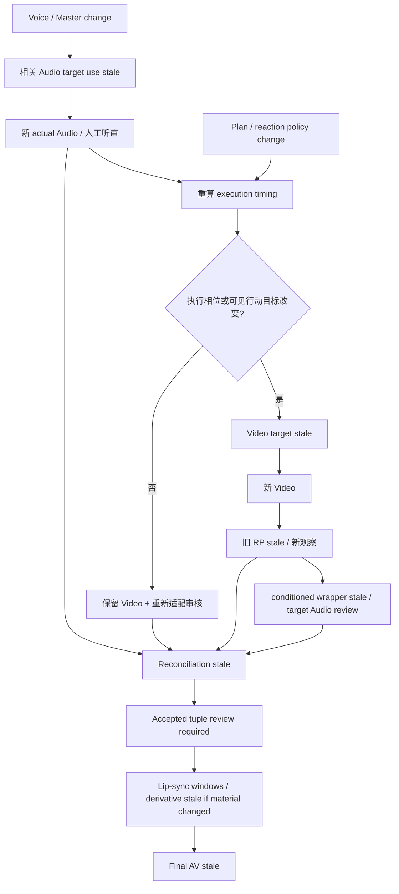
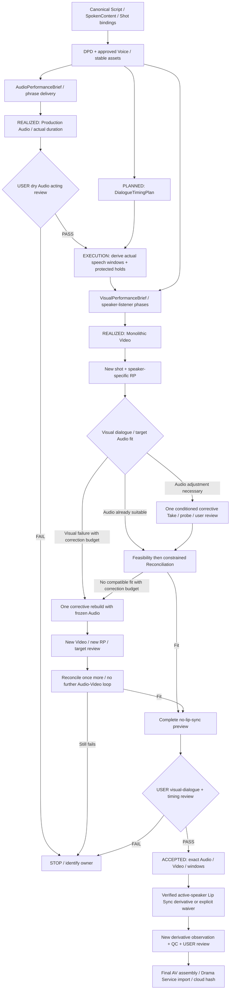

# Batch 7.5R — Cross-Layer Performance Coupling Reconciliation Audit

中文：跨层表演联动与生产链协调审计。日期：2026-09-05（Asia/Shanghai）。

## 1. 执行摘要

**BATCH_7_5R_AUDIT = PASS；生产系统尚未修复，当前 7.5 用户艺术验收仍为 FAIL。** 本次只形成协调设计，没有实施 Change Set。PASS 指审计交付完整，不指表演质量或下一轮 Provider 成功率。

主要冲突是：**视觉执行把原始计划估算当作当次发言时长，对账却采用实际音频时长；两者之间缺少共享的执行目标和目标视频适配审核。** 同时，旧视频条件配音的来源验证被用于新视频的时长对账，容易将来源有效误读为新目标下的 Final。

建议选择 **D：deterministic derived Visual Execution Timing**。复用 DialogueTimingPlan 的顺序、开场、反应和最低收尾要求，消费完整实际 Audio 的时长及当前生产目标，派生当次视觉执行窗口；不回写计划，不新增 Timing Entity。执行结果仍须经新视频观察和对账检验。

下一轮采用 **MONOLITHIC** 单 Shot I2V：先获得可听审且可冻结的生产 Audio，再以同一执行时间材料生成 Video。生成后先审核可见交流关系，再决定是否需要 Video-conditioned Take；不强制每条音频再生成一次。最多一次有证据的视觉纠正重建，纠正后冻结 Audio，不允许继续 Audio↔Video 轮流生成。分段视频缺少当前双人镜头连续性验证，暂不采用。

协调修改为 **P0=5，P1=3，DEFER=8**；推荐 **0 个新独立 Core contract，6 个新增字段（含 3 个内嵌值成员），2 个新小 helper**。其余是修改现有投影、校验、adapter 和执行顺序。Java/DB/MCP 新工具均为 0。

## 2. 审计范围与边界

审计当前工作树，而非假设所有历史实现已提交。起始基线记录了三个仓库 342 个 Git 跟踪及未忽略文件的 SHA-256；7.4/7.5 已有未提交修改属于输入。只新增本报告，保留已有代码、历史报告和所有媒体。

回读 audio-production、shot-production、dramatic-performance-direction 及视觉 Provider 规则，检查源码、contracts、历史报告、测试和本地 evidence。采用现有技能的职责边界进行审计，不执行其中的制作步骤。技能中的“观察可偏离 DPD 而不阻止记录”仍适用于保存事实；不能解释为用户艺术 FAIL 后仍可继续最终制作。

本次未访问 Domain 网络接口、未刷新云下载、未重新查询 Provider 目录。已有 durable metadata 和云哈希记录是历史存储证据，本次另对本地媒体读字节校验；不将它们声称为本日 Cloud roundtrip。没有音频听觉能力，未用 ASR、RMS、频谱代替人类听审。

```text
CODE CHANGES = 0             DOMAIN WRITES = 0
FISH = 0                    COMFY = 0
VOICE DESIGN / TTS = 0       VIDEO GENERATION = 0
LIP SYNC = 0                FINAL AV = 0
REPORT FILE ADDED = 1        COORDINATED IMPLEMENTATION = NOT_STARTED
```

## 3. Evidence Source Map

### 3.1 Authority 排序

技术事实：当前源码/contract > 当前 durable Domain/Media 事实 > 当前 evidence/fingerprint > 未被取代的最新报告 > 旧报告。对艺术评价，**最新明确 USER REVIEW 高于机器诊断和旧报告中的 PENDING**。二者是不同 authority 轴，不能互相覆盖。

本任务用户明确提供以下新输入，本报告是其记录位置，不回写历史 JSON 或 Domain：

```text
USER_VISUAL_DIALOGUE_REVIEW = FAIL
VIDEO_DIALOGUE_COORDINATION = FAIL
TURN_A_AUDIO_ARTISTIC_REVIEW = FAIL
TURN_A_NARRATOR_BIAS = STILL_PRESENT
LIP_SYNC = NOT_STARTED
```

### 3.2 历史设计来源

报告均位于本文件同目录，以下编号按实际文件匹配；历史中的 PASS 仅按各自范围使用。

| 来源 | 原本解决的问题 | 本次使用的结论及演变 |
|---|---|---|
| 53 / 7.2S；54 / 7.2S-R | 上下文传播、稳定声音与当前表演分层 | 早已有 Engineering PASS / casting、scene performance FAIL；不能把语义到达 Provider 当作表演成功 |
| 55–58 / 7.2S-R-E2E | Provider 拒绝、ambiguity、runtime、Qwen 迁移 | 身份/表演与传输错误分开；恢复既有输出不应重新付费生成 |
| 59 / 全架构审计 | timeline-first hybrid、Role Dubbing、Lip Sync 边界 | 最早已提出共同时间预算；当时推荐新 lip_sync Tool 的建议不继承到本次，当前要求新 MCP=0 |
| 60 / Fish 真实验证；61 / 多维传播 | Voice Design、master、casting 表现 | 有生成/声学差异不等于演员感；本地 master 与 durable Voice 身份必须区分 |
| 62 / Cross-modal DPD 审计 | 共享戏剧意图与模态执行分离 | 不重新发明跨模态平台；复用已建立的 DPD |
| 63 / Fish 正式落地；64 / Runtime/Storage reconciliation | Voice 长期记忆、Drama Service storage ownership | 63 自动选 master 的历史缺口随后由 68 修正；存储仍走 Plugin→Drama Service→MinIO |
| 65 / 7.3A | DPD contract/core | Scene→Beat→Line，why/action/target；不拥有音色、身体、精确时间 |
| 66 / 7.3B | AudioPerformanceBrief 与投影 | authority/activation/control 投影，早期 Fish 只收 speed/volume |
| 67 / 7.3B.1 | Fish expression、break、emphasis、标点 | 单请求句内实验可测有效；艺术效果 LIMITED；未证明分段拼接有必要 |
| 68 / 7.3B.2 | Voice use-case、human choice、exact master recovery | AI Top-1 不能成为 master；formal preview 与 identity narrator risk；materialization 降质未被隔离证明 |
| 69 / 7.3C | VisualPerformanceBrief 与 RP | 单行视觉投影；RP 是真实观察，不是 DPD 的重新解释 |
| 70 / 7.3D；71 / Fresh Voice resume | 按实际视频形成最终配音执行 | DPD+RP，NATURAL；Video/RP 变化使 conditioned projection stale；不是填满视频 |
| 72 / 7.3E | AVSync、mix、Final Shot | 最初缺 anchor；后续固定 B 5200ms 的合成是局部覆盖。Sync 3 仅目录/文档证据，无本双人 fixture 验证 |
| 73 / 7.4A | 完整对白计划及反应 | 5000/3200ms 为估算，500/800/最低500ms 是平台 policy；计划独立于 actual |
| 74 / 7.4B；75 / A 补全 | feasibility-first / placement-second | 完整 actual A/B 可容纳；不要缩写台词、压反应或默认延长 Shot |
| 76 / 7.4C | 完整对白本地 mux | A/B 放置与音视频流技术成立；用户否定整体交流表演 |
| 77 / 7.5 | 完整 speaker/listener phases、新 Video/RP | 计划相位确实进入请求；actual duration 未进入视觉执行；用户本次已否定完整预览 |
| 37 / 真实 I2V 验证 | single-image 与 start/end 输入约束 | start/end contract PASS，真实 end-frame E2E 未跑；不可推断连续分段可靠 |

### 3.3 当前代码锚点

下列链接指向实际文件。表中的函数名用于重放定位，不以旧报告描述替代实现。

| 标识 | 当前来源 | 审计事实 |
|---|---|---|
| C1 | [DPD core](/Users/zy/historical-plugin/drama-plugin/plugin/src/drama_plugin/dpd/core.py)、[DPD contract](/Users/zy/historical-plugin/drama-plugin/plugin/src/drama_plugin/contracts/dpd.py) | compose/fingerprint；不应扩展成 execution scheduler |
| C2 | [Audio projection](/Users/zy/historical-plugin/drama-plugin/plugin/src/drama_plugin/audio/projection.py:39)、[brief](/Users/zy/historical-plugin/drama-plugin/plugin/src/drama_plugin/contracts/audio_projection.py:35) | 当前按 authority band 及 activation/control 投影；无 phrase spans |
| C3 | [Fish renderer](/Users/zy/historical-plugin/drama-plugin/plugin/src/drama_plugin/providers/speech/fish_audio.py:189) | 有 brief 时只准 exact 单前缀；非正式手动路径才允许四个 marker/标点变化 |
| C4 | [Video conditioning](/Users/zy/historical-plugin/drama-plugin/plugin/src/drama_plugin/audio/video_conditioning.py:18)、[contract](/Users/zy/historical-plugin/drama-plugin/plugin/docs/video-conditioned-audio-contract.md) | 精确 source Video/RP 绑定；重建 base brief；普遍覆写句尾为 clear finality |
| C5 | [Role dubbing](/Users/zy/historical-plugin/drama-plugin/plugin/src/drama_plugin/providers/speech/role_dubbing.py:440)、[audio freshness](/Users/zy/historical-plugin/drama-plugin/plugin/src/drama_plugin/audio/foundation.py:138) | sourceRef cache 与 accepted-use freshness 是不同路径；前者命中即返回，后者要求 review PASS |
| C6 | [Timing planner](/Users/zy/historical-plugin/drama-plugin/plugin/src/drama_plugin/dialogue_timing.py)、[contract](/Users/zy/historical-plugin/drama-plugin/plugin/docs/dialogue-timing-contract.md) | 原始估算 authority；不可写入 actual |
| C7 | [couple visual](/Users/zy/historical-plugin/drama-plugin/plugin/src/drama_plugin/visual/performance.py:221)、[7.5 runner](/Users/zy/historical-plugin/drama-plugin/plugin/integration/prepare_batch7_5_visual.py:14) | planned windows / planned duration 直接变相对范围；无 Audio 输入 |
| C8 | [video prompt](/Users/zy/historical-plugin/drama-plugin/plugin/src/drama_plugin/visual/performance.py:138)、[RP](/Users/zy/historical-plugin/drama-plugin/plugin/src/drama_plugin/contracts/visual_performance.py:82) | coupled prompt 有轮次但压缩表演；RP 无结构化 speakerKey |
| C9 | [reconciliation](/Users/zy/historical-plugin/drama-plugin/plugin/src/drama_plugin/dialogue_reconciliation.py:55)、[replay loader](/Users/zy/historical-plugin/drama-plugin/plugin/integration/evaluate_dialogue_reconciliation.py:20) | 可显式 pin 历史 Audio source Video；当前 target RP 另行校验 |
| C10 | [AVSync](/Users/zy/historical-plugin/drama-plugin/plugin/src/drama_plugin/contracts/av_sync.py:33)、[assembly manifest](/Users/zy/historical-plugin/drama-plugin/plugin/src/drama_plugin/contracts/audio.py:361)、[mux](/Users/zy/historical-plugin/drama-plugin/plugin/src/drama_plugin/audio/host_media.py:107) | AVSync 是单 turn；已有 manifest 支持列表；通用 mux 的 -shortest 需完整时长 track 防截断 |
| S1 | [audio skill](/Users/zy/historical-plugin/drama-plugin/plugin/skills/audio-production/SKILL.md)、[shot skill](/Users/zy/historical-plugin/drama-plugin/plugin/skills/shot-production/SKILL.md)、[DPD skill](/Users/zy/historical-plugin/drama-plugin/plugin/skills/dramatic-performance-direction/SKILL.md) | 生产顺序、观察、artistic review、immutable 输入边界须协调更新 |
| S2 | [visual provider rules](/Users/zy/historical-plugin/drama-plugin/plugin/skills/shot-production/references/visual-provider.md) | 固定输入模式、2000 字符、有界 targeted revision、ambiguous 不重提 |

### 3.4 当前 evidence 与本次复核

根目录：[/Users/zy/historical-plugin/artifacts/batch7-5/evidence](/Users/zy/historical-plugin/artifacts/batch7-5/evidence)。关键文件：`user-voice-differential.json`、`user-voice-choice.json`、`turn-a-projection.json`、`turn-a-result.json`、`visual-projection-inputs.json`、`video-request.json`、`new-video-media.json`、`video-cloud-hash.json`、`new-rp-shot.json`、`new-rp-turn-a.json`、`new-rp-turn-b.json`、`visual-dialogue-compatibility.json`、`new-reconciliation-inputs.json`、`new-reconciliation.json`、`complete-preview-qc.json`。

本次以 `PYTHONDONTWRITEBYTECODE=1` 在内存调用现有 loader/core，未运行会写 evidence 的 main：

| 离线重放 | exact equality | 指纹 |
|---|---|---|
| 7.4B 当前完整 fixture | true | `c1ec9267e8aafc1f8bbe27f48c04fe4fe476aaeff604a7a85924e8b675913917` |
| 7.5 新视频 reconciliation | true | `c047741870189fd2496307dcfc9c08fe8d381fb0806a07c55a059131f8535b6e` |
| 7.5 coupled VisualPerformanceBrief | true | `9e640709909959af8898fdf674c83e8c8cd83e8f0fc945ff72a3bd85474a756a` |

本地 WAV 实际 PCM 读取：旧 A=4571.375ms（Domain 毫秒取整4571），新 A=3898ms；新 master=4086.712ms。新 A 哈希、master/candidate1 哈希、旧/新视频与 preview 哈希均与已有 evidence 相符。它们只证明字节/时长，不证明旁白偏差。

## 4. Current Fixture Failure Trace

固定 Work `work_9cc5d11969a64f93bce4a544f349c793`，Shot `shot_83db7eb53b2f49d3a58428d4659e584e`（潼关双人“三十骑之议”）。

| 顺序 | 实际事件 | Authority / 影响 |
|---|---|---|
| 1 | 7.3C 旧 Video `media_ac9d14c5cdc74c43ba44562752cf9489`，11042ms | 单行视觉 brief，未消费完整 DialogueTimingPlan。字节有效；对完整对白是 STALE_FOR_DIALOGUE_PERFORMANCE |
| 2 | 7.3D/B 配音4107ms；7.3E 旧 Final 主要覆盖 B | 视频先有、配音随后；局部 Final 不代表完整 A/B 成片 |
| 3 | 7.4A 计划 A500–5500，反应800，B6300–9500，post1000 | estimated A5000、B3200；planned total10500；plan fp `dfe0dc59…` |
| 4 | 7.4B 补齐旧 A4571ms | 500+4571+800+4107+500=10478≤11042；slack564；B5871–9978可放置。完整 physical FEASIBLE |
| 5 | 7.4C 依新对账 mux 完整对白 | 技术链成立；用户否定表演与嘴型，Phase B取消，5871未成为 timing approval |
| 6 | 用户判旧 master 本身旁白；7.5 Design 后选择候选1 | 新 Voice `voice_e8731619bea0467db69b197cef1299a1`；master `265c94c6…`；选择并非未来每次 Take 的艺术批准 |
| 7 | 新 A `media_57635a0ecc6649c48e7126a28908e45a`=3898ms | authority实际是 DPD_AUDIO_PROJECTION，不是新视频 conditioned final；B4107冻结 |
| 8 | 视觉准备仍从旧计划取时长 | A约5–52%、B60–90%，未读3898/4107；在11000ms provider目标下，B生产意图约6600ms开始 |
| 9 | 一次 Comfy `api_bfl_flux3_i2v` 生成新 Video | `media_859a7796181a433192e7984e31529e1a`；hash `99731a95…`；请求fp `176d8266…`；实际11042ms |
| 10 | 新 RP：A早段口/头变化；B较明显动作在后段 | B头/躯干约7500–8500，口形变化约7750–10000；是4fps采样近似，不能当作精确 speech onset |
| 11 | 新对账采用实际 A/B | A500–4398，反应800，B5198–9305，post1737；minimum9805，slack1237，physical FEASIBLE |
| 12 | 本地 no-lip preview 合成 | A/B各一次，完整、不截断、不重叠、无clipping；source video stream-copy；未入Final Media |
| 13 | 用户本次正式拒绝 | 视觉对白协调FAIL、新A艺术FAIL、旁白仍在；旧machine QUESTIONABLE仅保留为历史结果；D/E停止 |

必须区分三组数：计划 B6300ms；相对相位乘11秒的生产意图约6600ms；新对账 B5198ms。B实际较明显的后段变化并非第四个合法起音 authority。**不能把7750ms硬当锚点再反证“脚本物理超长”**。A/B总音频仅比原估算短195ms，但 A缩短1102ms、B增长907ms，内部交接偏移很大；只比较总时长会漏掉核心问题。

## 5. Current Architecture Reconstruction

```text
canonical SpokenContent + stable Voice/Casting + DPD
  ├─ Audio Projection → Fish → actual dry Audio
  └─ DialogueTimingPlan（估算） + per-line Visual Brief
       → coupled relative phases → I2V → actual Video → RP

RP + DPD + Voice → Video-conditioned Audio Projection → Fish → dry Take
Actual Audio + actual Video + RP + original plan
  → physical feasibility → linear placement proposal → human review
  → AVSync / AcousticMix / assembly → new Final Media
```

历史各层的局部边界成立，但跨层执行不闭合：

1. 当前 `couple_dialogue_visual_performance` 明确“不接 actual Audio duration”。这是7.5按当时限制实现的行为，不是 runner 漏传了已有参数。
2. per-turn VisualBrief 指纹被消费，但 phase focus 主要退化成 high-control 二分模板。coupled prompt 不输出累积的 performanceBoundaries，也不输出 transitionPurpose；因此“hash包含丰富brief”不等于“Provider收到丰富表演”。
3. Audio projection 当前用 authorityPosition 识别角色权力，不再把目标人物的 command 误当说话者自身；但其 SUBORDINATE 模板仍偏“间接警告/谨慎后果”，并非所有下位者都是劝诫。7.5 runner 的当次 override 没有修复通用行动表达。
4. 7.3D `condition_audio_on_video` 要求 base request 等于重新生成的基础 brief；7.5 手工调过的请求不能直接作为这个 base 被继承。若重新从基础开始，会丢掉先前有效的行动修正。
5. 现有 reconciliation 看完整音频预算，却没有把新 A/B speaker-specific RP 与 proposal 的每个阶段联合验证。`observedSpeakerKey` 单值配 aggregate RP 不能说明两个人何时交接。

## 6. Authority Matrix

| 层 | 最终解释权 | 不拥有 / 下游必须遵守 |
|---|---|---|
| SpokenContent | 说什么、speakerKey、canonical exact text、顺序绑定来源 | 不由 ASR、Provider、时间不足改写；分phrase不改正文 |
| Character / Voice Profile | 有证据的稳定人物理解与长期声学/选角基线 | 不决定本句心理行动或实际时长；UNKNOWN不靠姓名补全 |
| Voice Master / Casting | USER批准的具体身份、master bytes/hash及Work绑定 | mapping只实现同一身份；candidate approval不是所有Take接受 |
| DPD | 为什么说/行动、对谁、目标、策略、权力/关系、内部激活/外部控制 | 不拥有嘴型、音量、姿态、毫秒；RP不能反写 |
| DialogueTimingPlan | 创作计划的轮次、估算、反应意图及policy数值 | 不能覆盖已经测得的Audio事实；不能直接成为accepted timing |
| Actual Audio duration | 本次不可变音频的真实样本长度 | 不回写计划；不自动证明其语速/表演合理 |
| AudioPerformanceBrief | 将DPD与Voice基线转为说话行动、句式、呼吸/停顿/收尾要求 | Fish只渲染，不能重解释DPD；brief不是物理保证 |
| VisualPerformanceBrief | 将DPD与speaker/listener结构投成可见行动 | 不拥有相机/身份资产；不假定Provider准确执行 |
| Visual execution timing | **当次目标：完整actual durations + plan保护要求 + target budget的确定性派生** | 只有目标，不是观察、不回写plan；无Audio时仅可做planning preview |
| Video | 生成后真实像素、PTS、时长、音视频流事实 | 不因生成成功获得艺术authority |
| RealizedPerformanceSnapshot | 指定video hash、指定观察范围的可见事实 | 不推断内心；mouth movement不是phoneme；不决定该接受什么 |
| DialogueTimingReconciliation | 完整实际预算可行性，以及有约束的整句placement建议 | 不能补演员动作、接受timing、缩台词或强压反应 |
| Accepted Timing | USER/正式Production针对精确Video+Audio+proposal批准的窗口 | 不能装成observed mouth timing；新tuple需重新审核 |
| Lip Sync | accepted窗口内、选定speaker的嘴部视觉修正 | 不改start/end/reaction，不成为planner，不改对白音频 |
| Final AV | 用accepted输入、mix和assembly settings产生的不可变衍生物 | 不覆盖source；mux成功不是历史剧艺术PASS |

“最终 Audio 如何适应实际 Video”的责任是：**Audio Projection 只在DPD不变的范围内用已接受RP调整可说的执行；是否适配、是否复用，由目标Video适配审核与reconciliation共同检验；物理摆放属于后者。** 它不是“让TTS填满视频”。

## 7. Human Review Authority Matrix

| 审核 | Authority | 精确审核对象 / 失效条件 |
|---|---|---|
| Voice Candidate Approval | USER | design request + candidate hash/index；不能AI晋升 |
| Voice Artistic Acceptance | USER | master听感；新Take失败不自动判master失败 |
| Dry Audio Acting / narration | USER | exact audio hash + spoken/DPD/Voice；换Take重新听审 |
| RP observation acceptance | SYSTEM/具备观察能力的Production | 可复查视频事实；不是批准表演 |
| Dialogue Timing Artistic Acceptance | USER / Production | 新Video+最终Audio+proposal；只能批准该tuple |
| Visual Dialogue Performance | USER / Production；本项目以用户为准 | 两人交流、轮次、听者和reaction；明确FAIL覆盖机器QUESTIONABLE |
| Lip Sync Quality | USER / Production | 两speaker安全、identity/嘴音对应、连续性 |
| Technical QC | SYSTEM | hash、decode、coverage、duration、clipping等；不扩张到艺术 |

任何发布/最终使用门必须同时核对 **技术结果、材料freshness、目标适配、最新人工决定**。缓存命中不能绕过这些门；USER FAIL不可通过“重新读到PENDING metadata”消失。当前仅在报告记录新决定，下一实施批应把决定以hash绑定的既有review evidence接入执行校验。

## 8. Dependency & Staleness Matrix

记号：C=CURRENT（对原对象仍真实）；S=STALE（不能作为当次目标的当前产物）；R=RECOMPUTE（本地派生/验证，不等于重新调用Provider）；H=REVIEW_REQUIRED。历史bytes永不因S删除。表为vNext职责；当前缺失的级联需由P0落地。

| changed | Planning / Voice | Audio brief / Audio | Execution / Visual brief | Video / RP | Reconciliation / Accepted | Lip Sync / Final AV |
|---|---|---|---|---|---|---|
| Spoken text/order/speaker | Plan R，DPD关联H；Voice通常C，新speaker另resolve | 受影响brief S/R、Take S | R/S | 受影响Video S；旧RP C但非新目标 | S/R；H | S |
| DPD物质变化 | Plan intent H/R；Voice C | brief R、相关Take S | 相关投影R、execution保护要求H/R | request变则Video S；旧RP只描述旧视频 | S/R；H | S |
| Voice绑定/声学profile物质变化 | Plan C；选角H | 相关brief/Take S/R | 实际新Take前execution候选不可冻结；产出后R | Video目标H；时间/可见行动目标变才S | S/R；H | S |
| Master hash变化 | 必须新批准身份，禁止原master覆盖；Plan C | 同上；mapping重新核验 | 同上 | 同上 | S/R；H | S |
| Audio Projection变化 | DPD/Plan/Voice C | brief新fp，旧Take S；等待新actual | 当前旧时长只可暂作诊断；新actual后R | execution或可见action变才Video S；否则H | S/R；H | S |
| Actual Audio bytes变化 | 上游C | 旧Take历史C，新Take H | execution R；等时长/相同可见行动可保持相位fp | Video兼容H；相位目标变S；RP若视频未变C | 必S/R；accepted S/H | 必S |
| DialogueTimingPlan变化 | 新plan R；原DPD/Voice C（若未变） | NATURAL且不依赖窗口的Audio C；受约束brief才R | 必R | request变则Video S；旧RP C历史 | S/R；H | S |
| Visual Projection变化 | Plan/Voice/Audio通常C | 既有conditioned目标适配H，不默认重TTS | brief/request新fp | Video S；新Video前无新RP | S/R；H | S |
| Video hash变化 | DPD/Plan/Voice C | conditioned wrapper S；DPD Audio C、目标适配H | 原生成目标历史C | 旧RP S_FOR_NEW_VIDEO，必须新观察 | 必S/R；accepted S | 必S |
| RP事实/范围变化（视频不变） | 上游C | 消费该RP的conditioned wrapper S；Audio目标H | 原execution/Video C | 新观察fp，旧观察historical | S/R；H | 依赖选择/接受的sync与Final H/S |
| Reconciliation proposal变化 | 上游C | Audio C | execution历史C；不反向假装已生成新Video | Video/RP C | accepted S/H | 窗口变则S；仅诊断文字变则R/H，不重跑像素 |
| Accepted Timing变化 | 上游C | Audio C | C | source/RP C | 新review scope/fp | 窗口变则sync S，Final必R；批准元数据变仅重验证 |
| Lip Sync output变化 | 上游C | Audio C（若provider改音频则拒绝） | source C | derivative hash新，旧derivative RP S | 窗口保持；新derivative需重新绑定验证/H | source sync历史C，Final S |

### 8.1 Voice change正式级联

Voice变化不修改脚本、DPD、plan；先使受影响Audio候选失去当前身份适配。新Audio出来才有新的duration。执行材料重新计算：若时长/动作相位改变，旧Video不能继续充当当前执行实现；须重建并重新RP。若仅音色改变而时长及可见要求不变，Video像素和RP不必重建，但目标适配、人审、reconciliation、sync和Final输入必须重新确认。不能用“Voice没出现在Video hash”跳过适配审核。

### 8.2 Video change正式级联

新hash必有新RP；旧conditioned projection对于新Video是S，不得靠source pin称为current conditioned。其Audio字节/时长仍是C历史物理事实，可申请作为新目标的candidate；只有新目标适配审核接受后才可复用，且保留旧source provenance。Audio不变无需再probe推导新时长；Audio若重做，execution重新计算并进入第19节有界规则。reconciliation、accepted tuple、sync和Final均需失效处理。

### 8.3 CHANGE → STALE CASCADE



## 9. Planning / Execution / Realized / Accepted Timing

| 层 | 数据 | 谁计算/决定 | 当前 / vNext |
|---|---|---|---|
| PLANNED | DialogueTimingPlan：估算、顺序、pre/reaction/post、创作target | Shot/Dialogue planning + reviewed intent + policy | 已有；保持不变 |
| EXECUTION | 当次Audio/Video的目标与约束 | Audio brief控制自然说话；实际完整Audio后派生Visual execution timing | **跨Audio/Visual共享时长责任 MISSING LAYER**；已有TargetTimingPolicy和relative phases只是局部载体 |
| REALIZED | PCM时长、Video PTS/时长、按speaker观察的RP | probe / 观察 | 已有物理事实；不能伪装成计划或人审 |
| ACCEPTED | exact Video/Audio/proposal的最终使用窗口 | USER/正式Production | 7.5尚无；7.3E旧anchor不可继承 |

覆盖规则：actual不写回Plan；Plan不能在actual已知后继续独占execution duration；execution不能写成observed；RP不能重写DPD；Accepted Timing不能伪造成mouth-observed authority；Provider取整必须记在execution target与actual两个值中，不能偷偷更改Shot planned duration。

**派生算法责任**：验证plan当前性、每turn完整实际duration、DPD反应语义未变、生产target可用；保留pre及reaction最低要求，以actual whole-clip durations构成窗口，余量先保留最低post，再作为可审核slack。plan的post surplus是可分配预算，不是必须缩放音频的理由。生产target如继续11000ms，其依据是已有执行配置；10500ms仍为创作计划，11042ms只能等新Video后实测。

以现有7.5失败素材作离线例子（不是新批准）：target11000，A500–4398，reaction4398–5198，B5198–9305，post1695。相对目标约为0–4.55%、4.55–39.98%、39.98–47.25%、47.25–84.59%、84.59–100%。这明显不同于旧5–52%/60–90%；仅用于证明应派生哪类材料。下一Take若变化须重算，禁止硬编码这些数。

## 10. Audio Lifecycle Audit

`Final`目前有三个容易混淆的含义：7.3D projection的命名、技术有效dry output、整条已接受生产链中的最终Audio。只有第三个可称当前Final Audio。

建议不重命名所有旧contract，不改Media物理生命周期，采用生产使用语义：

| 状态/角色 | 定义 |
|---|---|
| PROVISIONAL / PRODUCTION_CANDIDATE | 完整exact-text、真实voice的dry Take；可以物理持久化和测duration；尚未被当前声画组合接受 |
| AUDIO_ACTING_ACCEPTED | 用户听审该exact hash的角色对白通过，可冻结作Video执行输入；仍不是整个Shot最终认可 |
| TARGET_REVIEW_REQUIRED | target Video、RP、相关execution或Audio改变；历史生成来源不改写 |
| ACCEPTED_FOR_TARGET | 该Audio在指定Video、RP审阅证据、timing proposal组合下通过；无条件全局“Final”不存在 |
| FINAL_AUDIO_FOR_ACCEPTED_SHOT | 上述组合与最终窗口已通过、无待定Audio修正；后续只允许mouth derivative与assembly |

真正的Video-conditioned Audio只能在其source Video/RP之后生成。vNext默认先做Production Audio取得真实时长，生成Video后检验该Take是否已满足可见表演；满足则零TTS复用，记录“target-reviewed reuse”，不得新造video-conditioned provenance。确需改变声音执行时，才产生一个新的conditioned candidate，重新probe和听审。

旧`VIDEO_CONDITIONED_FINAL_AUDIO`值保留为历史生成方式。对新target的“是否Final”必须从scope明确的acceptance推导，不从该字符串推导。旧B冻结不等于新target下已被接受；其durable reviewStatus仍是PENDING。

缓存语义需收口：sourceRef相同只表示生成材料相同，不能在用户拒绝后继续作为可接受Take返回。可返回既有artifact及明确rejected/pending诊断供审计；不能因此盲重生同一request。改变真正的acting projection才是新的有理由请求，不用随机attempt绕过人审失败。

## 11. Video Lifecycle Audit

当前 dialogue-aware Video应称 **VISUAL PERFORMANCE SOURCE**，不是FINAL VIDEO。它拥有完整可见交流关系、机位、身份和连续性；唇形仍可作为后续受限衍生变化。

生成技术有效 → 可见内容观察 → dialogue-performance review → accepted source →（已验证能力时）lip-synced derivative → derivative QC/user review → FINAL VISUAL FOR ACCEPTED SHOT。如用户明确waive lip sync，accepted source可直接成为最终视觉输入，但waiver必须记录，不能由系统默认。

新hash必有新观察authority。对仅容器变化、解码帧完全相同的特例，可通过确定性帧内容证据重建对应snapshot而不重新推断动作；不能直接把旧hash RP贴到新Media。对真实嘴部变化必须重新观察嘴部、非说话者及身份/连续性。

旧Video、7.4C preview、7.5 source和失败preview均保留diagnostic fixture。仅新报告记录USER FAIL，不抹掉曾有技术PASS、machine QUESTIONABLE和云hashPASS的历史。

## 12. Voice / Narration Bias Audit

| 来源假说 | 当前证据 | 结论 |
|---|---|---|
| A. Voice Identity | 用户明确旧master本身旁白；旧hash `716e09b7…`。新candidate1 hash `265c94c6…`被选择 | **旧Voice已确认失败**。新candidate选择并不充分证明master在全部场景均无偏差；新master是否仍明显旁白尚未被单独隔离 |
| B. Audio Projection / Fish rendering | 新A单前缀、无phrase-specific推进；当前通用下位者模板偏警告；conditioner普遍clear finality | **已确认投影/渲染能力损失与语义覆盖风险**；对听感的因果贡献需听审，不能声称已听到 |
| C. Visual Interaction Amplification | 新Video交接不清、B后段可见动作，与提前的音频proposal错开；用户明确Video协调FAIL | **视觉交互不成立已由用户确认**；它放大旁白感是合理假说，不证明它是dry Audio失败唯一原因 |

当前处理结论为 **MULTI_FACTOR，已缩小到投影/渲染与视觉互动；candidate1身份仍有独立听审缺口**。不得凭7.5新A失败立即再Design，也不得宣布声音身份已经完全排除。

可直接复用的听审证据，不生成新文件：

- [旧master](/Users/zy/historical-plugin/artifacts/batch7-5/review/voice-master-before.wav)
- [candidate1 / 新master](/Users/zy/historical-plugin/artifacts/batch7-5/review/new-voice-master.wav)
- [候选1双人试听](/Users/zy/historical-plugin/artifacts/batch7-5/review/voice-candidate-1-dialogue.wav)
- [新A dry Take](/Users/zy/historical-plugin/artifacts/batch7-5/review/02-turn-a-after.wav)
- [已拒绝完整预览](/Users/zy/historical-plugin/artifacts/batch7-5/review/05-dialogue-aware-preview.mp4)

`USER_LISTENING_AUTHORITY_REQUIRED`：需隔离“candidate1单听也旁白”“master可用但新Take旁白”“dry尚可而配画面更像旁白”。这个缺口**不阻塞本次P0协调设计和离线实现**，但阻塞下一次有成本的Voice修复分支选择；不应先花钱再问。当前用户新A艺术FAIL已足以禁止它直接进入下一次生产Video。

## 13. Audio Projection Information Loss 与 phrase-level acting

| 信息 | DPD/上游 | 当前Brief→Fish实际传播 | 问题/归属 |
|---|---|---|---|
| dramatic action | A请求有限兵力完成干预，获得批准 | generic projector主要按authority band；7.5 runner补direct request；Fish不读DPD | 不能让adapter重新解释DPD；应在Audio projection保留具体行动 |
| interaction target | 明确哥舒翰 | 7.5 control只说nearby listener；有对人指向但缺具体话语推进 | Brief表达目标关系；不能靠新增姓名规则 |
| authority relationship | 执行能力≠批准权 | articulation有subordinate约束，但不进入前缀五项 | 部分只存于hash/诊断；需明确supported/unsupported，不能宣称全消费 |
| rhythm / pause | 三phrase可推进 | 整句responsive phrasing/natural clause turns；原始逗号；没有逐处控制 | rich brief→一个前缀→整句统一语气的风险仍在 |
| sentence ending | 将决定留给听者 | 7.5 A前缀正确保留开放；7.3D会重建并覆写clear finality | conditioner不能抹掉行动所需开放句尾 |
| boundaries | 不公共煽动、不越权 | Brief有数组；Fish前缀不渲染 | 禁止默丢；关键边界应在中立执行指令压缩中保留 |
| emphasis / phrase action | 可由exact文字+DPD转化 | manual diagnostic支持emphasis/break；生产只准exact prefix+canonical | 7.3B.1“可用”未等于当前正式“实际用到” |

原文保持：`请给我三十骑，取杨国忠首级，为大帅除患。`

| 原文span（Python Unicode字符半开区间） | 基于正式DPD的可审阅行动推进 | 投影方向；不是固定人物规则 |
|---|---|---|
| [0,6) 请给我三十骑 | 提出有限资源请求，向批准者发起行动 | 直接起句，对人请求；在资源单位上落重点，不做公众宣告 |
| [7,13) 取杨国忠首级 | 将请求落实为具体干预目标 | 明确行动对象，短语有推进；不自动变怒吼/威胁 |
| [14,19) 为大帅除患 | 把结果落到听者利益，保留其决定权 | 回到听者，让请求待答；不以纪录片式事件总结收尾 |

这是Audio projection对已存在DPD/正文的解释提案，不新增DPD事实、不声称用户已经批准这种说法。不得把“三phrase必须三种情绪”当规则。

最小实现建议：在现有AudioBrief内允许可选的`phraseDeliverySpans`，每项仅`startChar/endChar/delivery`；span由投影/Skill基于canonical text与DPD给出并复核，不能由Fish猜语义。单次TTS内编译受限cue/标点/必要emphasis，保持exactText和词序、禁止控制标记被读出。无合适provider能力则显式UNSUPPORTED。不做phrase分段TTS、不建PhrasePlan实体/DSL。`BRIEF_CUES_V1`原义保留，新的rendering策略版本属于adapter，以旧请求不变、新请求新fp迁移。

67的官方/真实实验只能证明可渲染、有物理影响，不证明break精准、长期自然或同一cue必然改善；本次没有联网重新验证这些Provider声明。

## 14. Visual Timing Authority Conflict

最终选择：**D，派生Visual Execution Timing**。

- A原始plan窗口：仅有估算时可作规划，不足以作为已有actual时的唯一执行依据。
- B actual duration：必须消费，但它单独不拥有pre/reaction/shot budget。
- C reconciliation：依赖尚未生成的Video/RP，不能把未来结果当首轮Video输入。后续已审核修正可成为下一次execution的依据，但不是回写计划。
- D deterministic derived projection：组合actual与plan保护要求，正好填补缺失责任。
- E现有relative phases：作为D的承载输出继续复用，不另建Entity。

只改duration还不够。7.5 current coupled branch把不同per-turn brief压成“small head/facial changes”，并未输出transitionPurpose及performanceBoundaries。P0视觉修改要让已有可见方向真正进入phase focus、listener反应和Provider prompt，记录每项实际渲染/近似/不支持；不能以指纹存在冒充语义已落实。

不要求Video Provider毫秒精确。需要的是**输入目标同源、输出偏差可观察、偏差能在不牺牲反应和角色轮次的条件下被接受或明确拒绝**。Monolithic能否演到位仍是生产验证，不是通过这个helper自动保证。

## 15. Video-conditioned Audio Circular Dependency

无界路线 `A0→V0→RP0→A1→V1→RP1→A2…` 由两个错误触发：一是任何视频变化都机械重做声音；二是任何声音变化都机械重做视频。

正确区分：

1. **生成来源当前性**：A1若由V0/RP0生成，永远记录V0/RP0。V1出现后不能称A1为“由V1条件生成”。
2. **物理候选可用性**：A1字节、词文、声音身份和duration仍可验证，不因V1自动损坏。
3. **新目标适配当前性**：必须检查A1与V1的可见交流、时长和目标行动；通过人审可以复用同一A1，名称是target-reviewed reuse。

因此保留7.3D的严格source-conditioned fingerprint语义，同时取消“source不相同就必须无限新TTS”的生产策略。`STALE_CONDITIONED_PROJECTION`不能用兼容逻辑掩盖；但可以在明确另一个使用角色中复用已有字节。与7.3D文档“旧Audio stale需重生”的协调修订应明确：**若需求仍是新的conditioned generation则必须重生；若需求是把已认可Take适配新target，则先做独立适配审核。**

另外，conditioner应接收经过校验且已批准的基础brief，做必要局部执行调整，保留其phrase progression、target和句尾边界；不能无条件调用generic projector抹去7.5式修正，也不能用visible_activation/motion自动统一收尾。观测变化是否真的要求改声音要先列差异理由，零差异零TTS。

## 16. Reconciliation Compatibility Fix Audit

结论：**作为候选Audio来源审计和物理feasibility入口，7.5修复正确且有长期价值；作为“Final Video-conditioned Audio已经current”的模型不充分，若用于跳过目标审核则是技术债。** 当前源码/文档实际上保留PENDING与艺术UNKNOWN，没有直接实现艺术自动PASS；问题是生产编排和使用语义尚未闭合。

| 概念 | 7.5 frozen B实际值 | 正式含义 |
|---|---|---|
| Audio source Video provenance | old Video `media_ac9d…` + old RP `a2d3…` | B生成时真实来源，不可修改 |
| Audio intended target Video | new Video `media_859a…` | 本次希望组合的对象，必须独立审阅 |
| Final Video-conditioned Audio | 只能针对old source成立其生成命名；艺术接受仍PENDING | 不能将source pin当作新target的conditioned current |

对“旧Video/旧RP生成Audio + 新target”逐项回答：

```text
TECHNICALLY_CURRENT_AS_SOURCE_ARTIFACT = YES（hash/identity/QC校验成立时）
TECHNICALLY_CURRENT_AS_NEW_TARGET_CONDITIONED_OUTPUT = NO
ARTISTICALLY_CURRENT_FOR_NEW_TARGET = NOT_ESTABLISHED / REVIEW_REQUIRED
VIDEO_CONDITIONED_CURRENT_FOR_NEW_TARGET = NO
ELIGIBLE_FOR_DIAGNOSTIC_DURATION = YES（保持其失败/待审标签）
ELIGIBLE_FOR_FINAL_AV = NO，直到target组合及timing被明确批准
```

当前 `_audit_audio` 仅接受review PASS/PENDING，FAIL不会被选为完整realized候选。用户新FAIL还未写入历史metadata，所以历史replay仍得到PRESENT，这是**历史重放成功**，不是本次用户判决失效。vNext不修改旧fixture；新的production selector须读取当前review evidence并阻止拒绝Take投产。若审计需要测失败Take预算，应采用显式diagnostic读取，不把它又算成production-current。

## 17. Monolithic vs Segmented Video Production

**本次决策：MONOLITHIC，保留单张正式source frame的单11秒级I2V执行策略；不采用未经证明的segmentation作为当前P0捷径。** 这里决定的是最小待验证策略，不承诺相位精确生成。

| 维度 | A：单片I2V | B：turn-based分段 |
|---|---|---|
| Timing controllability | 模型内相位会漂移；必须派生同源目标+后验适配 | 边界可显式安排；段内speech时长仍非保证 |
| speaker ownership | 依赖phase要求和观察 | 每段active speaker更单一，但仍可能两人同时动嘴 |
| listener behavior | 可保持自然连续听取 | 段间listener状态可能重置 |
| reaction controllability | 可见交接可能缺失；需硬门 | 可单独制作reaction，但会增加剪接边界 |
| identity preservation | 当前fixture单镜头采样相对稳定 | 多次生成增加独立漂移机会，短段并不自动更稳定 |
| camera continuity | 一个连续实现较好 | 锁机位prompt也不能保证重启时完全一致 |
| background continuity | 单次背景稳定性有现有证据 | 光照、地图、手部、服装可能在段间跳变 |
| motion continuity | 无stitch边界 | end frame只携带位置，不携带速度/呼吸状态，可能跳动 |
| cost | 首轮1个generation | 按Opening/A、reaction、B、ending直拆约4个；合并holds最小仍约2个 |
| provider calls | primary1，明确纠正最多再1 | 至少2或更多，continuation失效可能级联 |
| retry isolation | 重做整片成本高 | 单段可重试，但下一段若消费末帧也会stale |
| Lip Sync complexity | 仍需turn窗口+face selection | turn切段更方便；每段仍须可靠选face并保持listener安全 |
| staleness scope | 目标改变通常整片target失效 | 局部理论较小；链式endframe会向后传播 |
| artifact lineage | 1sourceVideo+1RP组 | 每段hash/request/RP + assembly/边界表更多证据 |
| final visual quality | 连续性较可信，timing不足已暴露 | 可控边界收益尚未与jump/drift成本比较验证 |

当前能力证据：7.5真实跑通`api_bfl_flux3_i2v`的single-image、11s、无音频路径；saved/current双人end-frame continuation没有可靠生产验证。37报告明确`START_END_VIDEO_REAL_E2E=NOT_RUN_NO_EXISTING_FRAME_PAIR`；它验证的是合同形状，不是当前Flux continuation。无证据证明短segment更少identity drift，也无证据证明末帧衔接解决动作跳变。**不能回答“已有start/end足够”：目前不足以支持可靠分段方案。** 本次不重查目录，不使用未经保存的最新能力猜测。

保留monolithic如何处理已知drift：生成前统一actual执行目标；生成后按speaker观察并形成可审核的参与/交接范围；reconciliation在保护reaction、post与可见ownership的可行集合中给proposal；不能适配则一次有明确原因的视觉纠正，仍失败停止。它不是只“优化prompt”，也不靠调整Audio提前播放掩饰迟来的回应。

若未来monolithic在同源目标和一次纠正后仍失败，输出`VIDEO_EXECUTION_CAPABILITY_LIMITATION`，另行验证分段能力。最小分段方式只能是现有Shot Production的有序执行列表+source/end hash+既有Media+本地continuity assembly；不建Video Segment Service、Timeline或新Shot业务实体，不擅自扩大当前调用预算。

## 18. Lip Sync Architecture Position

```text
accepted dialogue-performance source Video
+ final-for-target dry Audio A/B
+ reviewed reconciliation windows / Accepted Timing
→ verified active-speaker Lip Sync
→ new derivative Video
→ derivative observation + technical QC + USER Lip Sync review
→ accepted derivative binding → Final AV
```

| 问题 | 决策 |
|---|---|
| consumes哪条Video | 已通过完整对白视觉审核的source；不是7.5当前FAIL fixture |
| consumes哪条Audio | 已冻结、听审并适配target的最终dry Audio；不使用provisional或混合二人音频替代speaker选择 |
| reconciliation之前/之后 | 必须之后，并先获窗口及视觉对白明确批准 |
| 可以改duration吗 | 不可改变accepted presentation timing；若provider产出增删帧/重定时，拒绝作为当前derivative。容器取整差异须以PTS/帧数证明实际时间轴未改 |
| 可以改identity吗 | 不被授权；face/eyes/beard/skin/costume/background/camera与non-speaker均须QC |
| output是否改变RP authority | 改变bytes和mouth事实；旧RP仍是source观察，只能历史引用，不是derivative新嘴型证据 |
| 之后是否再观察 | 必须；嘴部/非说话者/身份/连续性新观察。若变化超出mouth ROI，补全受影响全身/场景观察并拒绝不合格结果 |

优先两个turn-specific operations，各绑定对应Audio和明确selected face/track，窗口在accepted时刻切分并可逆重组；仅在workflow明确支持该选择、身份保持和段时长不变时执行。若平台验证完整active-speaker控制可覆盖同样约束，才可一个operation处理全片。目录存在`api_sync_so_lip_sync_video`不是验证；当前两人、侧脸/胡须/switch未跑，不应给PASS。

当前AVSync把`AUDIO_DRIVEN_RETARGET`绑定到`AUDIO_DRIVEN_ALIGNMENT` timingAuthority，可能将嘴部处理方式误当时间来源。P1需分开：USER_REVIEW窗口仍由用户拥有；mouth方式只指derivative operation，不得为了调用lip sync改写authority。无需新增服务或MCP CRUD，可在现有adapter/evidence执行并修正现有validator语义。

若能力不足：`LIP_SYNC=BLOCKED_BY_CURRENT_WORKFLOW_LIMITATION`，下一最小动作是验证speaker segmentation/face selection或替代可验证workflow；不能依默认双人混音推理，也不自动换Provider。

## 19. Production Loop / Convergence Model

建议采用 **audio-first execution，video-conditioned correction optional**，不是两条路线互斥，也不是无条件“每次Video后重TTS”。

```text
固定 SpokenContent + DPD + approved Voice + immutable Plan
→ 审核Audio行动投影 / 必要的Production Audio（真实duration）
→ dry Audio acting review，通过后冻结A/B
→ derive execution timing（actual + protected plan + target）
→ dialogue-aware single-shot I2V
→ new RP（shot + A + B），视觉交流结构检查
→ 目标Audio适配审计：
   已合适：复用，零TTS；保留原source provenance
   声音执行确需调整：最多一次post-video corrective Take/affected turn
→ final duration delta / dynamic slack / visible ownership fit
→ complete reconciliation + no-lip preview
→ STOP USER REVIEW
```

若Video本身明显不交流，先回Visual Projection/Realization，禁止用conditioned Audio补救。若dry Audio已旁白，先修Audio而非让Video陪它一起生成。纠正的对象必须有明确failure owner，变更依赖同批重算。

“最多一次corrective loop”是本平台成本/收敛policy提案，并非电影行业标准。首轮V0后允许最多一个V1；其中可包含必要的A1，但不能循环产生A2/V2。

## 20. Convergence Stop Policy 与动态容差

定义每turn duration `d[i]`，最低/受保护pre为`p`，已审reaction要求为`r[i]`，最低post为`h`，actual Video时长`V`。整句窗口起点为`s[i]`：

```text
s[0] >= p
s[i+1] >= s[i] + d[i] + r[i+1]
s[last] + d[last] + h <= V
全部语音完整、顺序一致、不重叠
```

第一道预算为 `p + sum(d) + sum(r) + h <= V`。第二道是每段整句与**经过复核的可见active-speaker/listener/transition兼容范围**相容。范围来自观察加Production解释，保留method/不确定性；不是把head/mouth窗口原样当speech anchor。范围UNKNOWN则交人审，不得自动SUPPORTED；明确冲突则无可接受proposal。

所谓safe tolerance，是新duration向量存在满足上述约束且不破坏可见交流的窗口解；不是固定±500ms，也不是只看总delta。既有post surplus与actual视频多出的预算可吸收差异，但反应空间、最低收尾、已观察的交接关系受保护。动态solver职责只需少量有序区间算术；没有可靠观察区间时不能凭算法补造。

当前fixture的1237ms是**物理剩余预算**，不是艺术容忍度。若假设B必须到7750ms才起音，4107ms会超出视频；但该假设未获观察/用户anchor权威，不能据此得出脚本冲突。

终止规则：

1. **无修正**：完整Audio已听审，Video交流和动态fit成立，直接对账/preview。
2. **Audio修正**：明确Audio owner且Video可用时，每受影响turn最多一个post-video Take；probe后可适配则对账，不重Video。
3. **一次视觉纠正**：只有执行目标错误、明显visual realization失败，或经审核的最终duration无法在保护条件内适配，才可使用1次V1。重新派生execution，固定已有最终候选Audio及其他正确层，保留与V0的差异理由。
4. V1后必须重新RP/target review/reconcile；可以接受同一Audio为target-reviewed reuse，绝不能伪造其conditioned provenance。若V1仍需再改Audio/Video才能成立，停止`CONVERGENCE_NOT_REACHED`，不得A2/V2。
5. dry Audio首次修正后仍艺术FAIL、Voice master隔离未完成、provider能力不足或用户否定且需超预算，提前停止；不消耗剩余预算凑成功。
6. 技术瞬态retry最多2，且只有可证明未创建job的submit才能重提；不确定结果先恢复同一operation。技术retry与artistic corrective generation分账。

## 21. Fingerprint / Staleness vNext

区分**生成材料hash**、**真实bytes hash**、**当前使用/审核依赖**。失效使用许可不必强行改变历史生成hash；这样避免“everything hashes everything”。

| 节点 | 最小material | 强制cascade / 不应引入 |
|---|---|---|
| Voice fingerprint | approved master hash、稳定Voice/Profile、有效mapping材料 | 声音身份改变使相关Audio请求stale；不加入当前视频/时间 |
| Audio projection fp | canonical text hash、DPD、Voice基线/身份、实际使用的timing policy、执行brief/phrase spans | actualAudio还未生成，不倒挂其hash；不hash整个Work |
| Audio request fp | projection/rendering策略版本、渲染文本、模型mapping/实参、pronunciation | 相同语义但真实rendering改必须新fp；technicalreview/用户意见不伪装为生成参数 |
| Actual Audio hash | 原始输出bytes；物理probe另存sample duration | 任何bytes改变强制reconcile/sync/final失效；不改变Plan |
| Execution material fp | schema/helper policy版本、plan相关保护要求、ordered id/speaker/actual durations、target、真正使用的phase/action材料 | **等duration且相同视觉行动的换Audio**不必改变phase生成hash；独立输入evidence仍绑定新Audiohash并要求target review |
| Visual brief fp | per-turn可见投影、稳定身份、plan lineage、execution material fp及phases | 不依赖Voice原始音色；不把无关Scene open content/hash引入 |
| Video request fp | 上项+source frame hash、camera、prompt、真实provider execution settings | 当前业务request fp不含全部adapter设置；保留中立request fp，再在adapter提交指纹绑定template/version/seed/resolution等 |
| Video hash | 输出bytes / PTS证据 | 新Video必新RP和target审核；request fp不能代替实际hash |
| RP fingerprint | 指定video hash/shot/duration、结构化speaker scope、可见事实及采样方法 | 只依赖像素观察；Audio改、意见改不使原观察事实虚假 |
| Reconciliation fp | Plan、targetVideo hash/duration、新scope RP组、selectedAudio hashes/durations、保护要求、execution/compatibility evidence、proposal | 目标scope/Audio/观察改变必须重算；rejected候选增删不应不必要改变“已选tuple的placement材料” |
| Accepted Timing fp | 被批准的proposal、精确Video/Audio tuple、用户/Production决定scope | 不进入上游生成hash；review撤销只撤销使用许可 |
| Lip Sync fp | accepted窗口、sourceVideo hash、各turn Audio hash、speaker selection/mask/track、adapter设置/版本 | 不依赖整份DPD全文；有明确上游引用链即可 |
| Final AV fp | accepted derivative hash、A/B hashes、有序完整manifest、accepted timing/review引用、mix、mux版本/settings、lip provenance | 不用旧单D1 fp冒充完整对白；不加入临时URL、时间戳、Host或秘密 |

current overcoupling须克制修正：7.5runner用整个shot对象和Scene.content算visual身份，容易把无关metadata/对白状态变成视觉身份变化；应换成实际使用的白名单视觉材料。current reconciliation还hash了全部相关candidate和voice mappings，用于选择审计有价值，但可以和已选tuple的生产指纹分开：candidate-set变化重跑选择校验，若选择和材料不变，不要求付费重生成。

Plan或DPD语义变化虽可能生成同样时间数值，仍须重新semantic review；这与“声音hash等时不必重Video”不同。旧fingerprint保持原算法历史可重放；新字段为空时legacy hash不变，启用vNext材料才生成新hash。

## 22. Canonical Single-Shot Production Order vNext

### CANONICAL SINGLE-SHOT PERFORMANCE PIPELINE vNEXT



图中纠正分支共享一个V1预算，不可分别各用一次。任何人审等待都在同一实施批次恢复，不新建五个正式批次。

### 每步执行责任

| Step | INPUT | OUTPUT / 类型 | AUTHORITY | STALE WHEN | REVIEW GATE | PROVIDER CALL? |
|---|---|---|---|---|---|---|
| 01 Canonical scope | Script/Scene/Shot、ordered bindings | canonical exact SpokenContent A/B / authored | Script/SpokenContent | text/speaker/order/coverage变化 | 内容已批准；无证据不改剧本 | NO |
| 02 Identity | stable Character/Voice Profile、已批准candidate/master、visual assets | 当前绑定/参考hash / accepted identity | USER casting、正式Asset/Voice | master/binding/identity变 | 缺失或Voice失败先隔离；不得自动Design | 默认NO；另行批准design分支才YES |
| 03 DPD | approved Scene/Beat/Line | DPDSnapshot / planning | DPD | material语义变化 | formal production DPD；新旧planning DPD语义差异需审阅 | NO |
| 04 Planned timing | order+estimates+DPD+intent+policy | DialogueTimingPlan / planning | planning intent | 输入/policy改变 | 反应语义有据；不读actual回写 | NO |
| 05 Audio execution | exact text+Voice+DPD+NATURAL | AudioBrief+phrase spans+render diagnostics / planning-execution | Audio Projection | 消费的语义/Voice/策略变 | 单句人际行动、正文守恒；不按估算拉伸 | NO |
| 06 Production Audio | 当前请求、approvedVoice | dry candidate+probe/hash/QC / realized | physical Audio | 实际换Take；旧bytes保留 | ASR/技术；不能覆盖艺术 | YES，仅必要turn |
| 07 Audio acting freeze | dry Audio + master比较 | hash-bound audio acting acceptance / accepted-for-production | USER | 换Audio或明确撤销 | 未通过不得花费Video生成 | NO |
| 08 Visual execution timing | 完整actual A/B durations+plan保护要求+target | transient execution材料+fp / execution | deterministic helper | 使用的duration/顺序/反应/target变 | 完整预算；无actual不称production-ready | NO |
| 09 Visual projection | DPD+orderedSpoken+perturnbrief+execution+assets/camera | coupled VisualBrief+request/adapterfp / planning-execution | Visual Projection | 任一真正消费材料改变 | active/listener/reaction和边界实际进入request | NO |
| 10 Video production | 单张正式source+validatedrequest | new visual performance source / realized | pixels/PTS | 新Video；旧实现保留 | 1primary，瞬态幂等；无艺术保证 | YES Comfy |
| 11 Realized observation | 新Video | shot RP + speaker RP映射 / realized | observable facts | video hash或观察scope/facts变 | 采样/回放可复查；不猜内心或起音 | NO |
| 12 Target fit / optional dubbing | Audio+Video+RP+DPD+execution | target compatibility evidence；必要时新conditionedTake | Audio Projection + Production review | tuple变化 | Video失配不靠TTS；Audio改变再听审 | 默认NO；有因果必要才YES |
| 13 Reconciliation | 完整actualAudio、新Video/RP组、Plan、execution/适配证据 | full feasibility+whole-line proposal / realized-derived | Reconciliation | 输入/观察/建议变化 | 先物理后可见相容；保护reaction；至多一次纠正 | NO |
| 14 Complete preview | sourceVideo+currentA/B+新proposal | no-lip-sync本地review preview | assembly technical evidence | 上游任何material变 | **STOP USER REVIEW**；FAIL不得lip sync | NO |
| 15 Acceptance | 用户对精确preview/tuple的明确批准 | Accepted Timing、target-acceptedAudio/Video | USER / Production | hash/window/review撤销 | 不继承5200/5871/5198；批准scope明确 | NO |
| 16 Lip Sync | accepted source、finalAudio、acceptedwindows、verifiedface | new mouth derivative / realized | adapter嘴部执行 | Audio/window/face/source变 | capability verified；不变时轴音频；不足则BLOCKED | 后续YES，按必要operation |
| 17 Derivative review | source/derivative比对、对应dryAudio | 新观察、identity/non-speaker QC、lip acceptance | SYSTEM technical + USER art | derivative变 | 未通过不得Final；waiver须明确 | NO |
| 18 Final assembly | accepted视觉、完整A/B、acceptedtiming、AcousticMixPlan | new FINAL_AV+manifest/fp / realized derivative | accepted输入+assembly | 任一实际输入/设置变 | coverage完整、一次、不截断、不重叠、不clipping | NO generation |
| 19 Durable verification | Final媒体字节+provenance | Media import/get/resolve/download/hash | Drama Service / Cloud MinIO | bytes/hash不符 | playable、双流、duration、lineage/QC；系统PASS≠艺术PASS | NO生成；有storage调用 |

P0实施首次至Step14停止。Step15–19为后续明确批准恢复的同一生产链，7.5R不执行任何一步的生产操作。

## 23. Current Cross-Layer Conflicts

### CONFLICT-01 — 计划估算与实际执行

- Node A：DialogueTimingPlan / planned phase ranges。Node B：actual A/B与reconciliation。
- Contradictory authorities：Video按5000/3200，Audio按3898/4107。
- Observed evidence：C7、new-reconciliation、failure trace8/11。
- Why local patch dangerous：只挪B时间不改Video生成目标，会重复得到不同步的交流行为。
- Required coordinated fix：execution派生、VisualBrief/request fp、RP与对账共同切换到同一当次材料。

### CONFLICT-02 — 旧source配音与新target

- Node A：B的oldVideo/oldRP conditioned provenance。Node B：newVideo target。
- Contradictory authorities：历史来源有效被误解为新目标conditioned current。
- Observed evidence：C9显式source pin；B仍旧hash4107。
- Why local patch dangerous：为了通过lineage继续放宽校验，会绕过目标表演审核。
- Required coordinated fix：保留来源校验，新增使用scope的target审核；旧wrapper对新目标仍stale。

### CONFLICT-03 — visual phase与post-video placement

- Node A：B约60%开始的可见请求和较晚的realization。Node B：5198ms音频proposal。
- Contradictory authorities：物理fit被误读为可见交接fit。
- Observed evidence：C8/C9、A/B RP与machineQUESTIONABLE。
- Why local patch dangerous：将mouth/head窗口硬当speech anchor会制造另一种假authority。
- Required coordinated fix：可见参与范围与不确定性进入适配门；无兼容解则纠正Video或停止。

### CONFLICT-04 — Final Audio命名与未来Video重建

- Node A：`VIDEO_CONDITIONED_FINAL_AUDIO`生成标签。Node B：视频仍可能纠正。
- Contradictory authorities：尚未封闭的candidate被称Final。
- Observed evidence：70 strictstale、77 DPD_AUDIO_PROJECTION与旧B混用。
- Why local patch dangerous：每换Video强制重TTS引发无限循环；或者反过来假装旧配音仍Final。
- Required coordinated fix：final-for-target语义、optionalpost-video修正、统一纠正预算。

### CONFLICT-05 — RP范围与speaker身份

- Node A：单snapshot无结构化speaker。Node B：两speaker与aggregate观测。
- Contradictory authorities：caller单observedSpeakerKey不能证明snapshot内事实属于该人。
- Observed evidence：C8 snapshot字段、C9单观察入口；7.5三个RP仅文本标scope。
- Why local patch dangerous：把aggregate mouth UNKNOWN替换成某个人PRESENT会错误扩大整镜头支持。
- Required coordinated fix：一个optional observedSpeakerKey和新RP映射校验；aggregate不冒充speaker。

### CONFLICT-06 — Voice approval、技术freshness与新Take艺术FAIL

- Node A：candidate1用户选择、技术ASR PASS/cache hit。Node B：本次新A旁白FAIL。
- Contradictory authorities：身份选择/技术质量不等于新Take表演通过。
- Observed evidence：user-choice、turn-a-resultPENDING、本次用户FAIL、C5。
- Why local patch dangerous：反复Design会换Voice→Audio→Video全链stale；缓存旧Take又可能抹掉人审。
- Required coordinated fix：先master/dry/preview隔离；hash-boundreview进入使用门；修真正AudioProjection/Voice节点。

### CONFLICT-07 — Lip derivative与Final/RP authority

- Node A：未来嘴部derivative。Node B：原Video/RP/AVSync绑定。
- Contradictory authorities：嘴部处理可能改hash却被视为原视频；retarget policy可能强制换timingAuthority。
- Observed evidence：C10 AVSync校验、72目录仅available、无实际lip fixture。
- Why local patch dangerous：复制旧RP/acceptedbinding或让provider处理时長会破坏审核链。
- Required coordinated fix：derivative lineage、时轴不变验证、newmouth观察与人审，不改USER timing来源。

### CONFLICT-08 — rich projection存在与实际rendering丢失

- Node A：formalDPD/AudioBrief/perturnVisualBrief。Node B：单前缀与genericphasefocus。
- Contradictory authorities：hash记录输入丰富，却实际输出统一语气/动作模板。
- Observed evidence：C2/C3/C7/C8；7.5renderer全文、coupled branch未输出boundaries/purpose。
- Why local patch dangerous：仅换音色或重复I2V无法恢复未传递的行动信息。
- Required coordinated fix：Audiophrase执行和Visualphase执行同步补齐，adapter逐维报告实际消费。

### CONFLICT-09 — conditioner覆盖已修正brief

- Node A：7.5请求的direct/open-ending修正。Node B：conditioner从genericbase重建、统一clearfinality。
- Contradictory authorities：下游观测修饰反而覆盖上游行动。
- Observed evidence：C4的base比较与sentence_ending更新。
- Why local patch dangerous：每次Video后重新产生旁白风险，先前Audio修正又失效。
- Required coordinated fix：校验并保留已认可base，仅修改有可见证据支持的执行差异。

### 为什么不能继续一点一点修

当前证据已形成具体循环：换候选1把A从4571缩到3898；视觉仍用5000；对账又把B从5871移到5198；随后如果重新Video，旧B conditioned lineage失效；若强制再做B，4107可能改变，视觉又失效。每一步局部“通过”都可能使下一步的依据过期。另一方面，brief→singleprefix与perturnbrief→genericfocus这两处信息损失不会被hash验证发现。

因此要一起改变的是**执行目标、候选/Final语义、实际投影传播、目标适配/观察与失效校验**。这不意味着所有素材都重做：B在新目标下可经审核复用，Voice没有独立失败证据不重Design，DPD/SpokenContent不动，存储问题不混进Core。

## 24. Coordinated Change Set

以下均为下一批建议，**本批未实现**。每个变更必须与依赖一起落地后才开始付费E2E。

### P0-1 — 统一 execution timing material

- Current problem：计划与actual使用两套发言时长；没有actual→visual依赖。
- Owner layer：Dialogue Timing的执行派生、Visual Projection。
- Exact responsibility change：新增一个纯`derive_visual_execution_timing`小helper，读完整actual durations、原Plan保护要求、target；返回有序窗口/相对phases及白名单material fingerprint。既有VisualBrief加optional `executionTimingFingerprint`；couple接受派生结果。禁止actual回写Plan。
- Affected：`dialogue_timing.py`、`visual/performance.py`、`contracts/visual_performance.py`、visual integration、shot-design/shot-production技能与相关contract文档。
- Expected stale cascade：actualduration变化→execution→brief/request→Video目标→新RP→对账。等时长换Audio仍触发target review/reconcile，不强制Videohash变化。
- Migration：原计划/7.3/7.5旧brief可历史重放；旧planned-only brief无execution证据时仅planning/diagnostic，不自动标生产current。planningDPD与productionDPD不同须审反应语义是否仍相容，不盲换hash。
- Tests：actual3898/4107映射、顺序乱序/缺turn、反应/最低post、target不足、planbytes不变、等时长换hash最小cascade、legacyfp。
- E2E：新request同时展示plan和actual-derived相位；数值来自当前Take，不能把本报告示例写成常量。

### P0-2 — Audio lifecycle与目标使用门

- Current problem：Final标签、source pin、PENDING metadata/cache与USER FAIL分离。
- Owner layer：Audio production/role-dubbing使用策略、review evidence。
- Exact responsibility change：分source-valid、target-review-required、accepted-for-target。保留immutable conditioned provenance；停止将cache命中当艺术current。新目标复用须显式review tuple；失败Take禁止投产，无理由不重生相同request。
- Affected：`audio/foundation.py`、`providers/speech/role_dubbing.py`、`audio/video_conditioning.py`、reconciliation selector/runner、audio skill与7.3D文档。
- Expected stale cascade：Voice/Audio/Video/RP变化撤销对应target acceptance，必重算对账；不自动重Voice或所有Audio。
- Migration：旧performanceAuthority值保留；旧Audio默认SOURCE_VALID_CANDIDATE，不批量改Domain；外部review sidecar按hash约束使用。状态是使用语义，不加数据库lifecycle。
- Tests：USER FAIL覆盖旧PENDING/cache、旧source可诊断不可final、source/target不同、跨Work/Shot拒绝、同bytes重新target审核不伪造wrapper、review撤销。
- E2E：B frozen真实hash可参与fit，但新target接受必须独立；A新Take通过dry听审后才进入Video。

### P0-3 — Audio行动传播与条件配音保真

- Current problem：通用authority模板覆盖行动差异、singleprefix丢phrase推进，conditioner重建/统一finality。
- Owner layer：Audio Projection；Fish仅负责受限渲染。
- Exact responsibility change：在AudioBrief窄增`phraseDeliverySpans`（内嵌3成员），用现有DPD+exacttext解释每phrase人际行动并校验。修改现有Fishcompiler单请求渲染，记录逐维消耗/降级；conditioner保留已审base且只做有证据的局部差异。禁止新增情绪分类器或人物分支。
- Affected：`contracts/audio_projection.py`、`audio/projection.py`、`audio/video_conditioning.py`、Fishrenderer、`contracts/audio.py`已有rendering允许值、audio skill/scene-aware规则、resume runner移除硬编码acting override。
- Expected stale cascade：新brief/renderfp→必要A Take→actualduration→P0-1/P0-4/P0-5；B不因A修正自动重做。
- Migration：旧`BRIEF_CUES_V1`保持exact单前缀语义；新adapter策略显式opt-in；空phrase字段排除legacyfp。新Voice design默认0，仅master独立失败分支可另走humanchoice。
- Tests：Unicode span/lexical守恒、重叠/越界拒绝、三phrase不同delivery、匿名speaker invariance、关键边界不得默丢、开放句尾conditioning回归、unsupported诊断、marker不当正文。
- E2E：最多一个主要A TTS；新dry Take角色感/旁白必须由用户听审，ASR只是技术。未通过不生成Video。

### P0-4 — 单片视觉执行与可见交流信息传播

- Current problem：旧相位时间、genericfocus、boundary/purpose未进入coupledprompt；生成后drift缺闭合处理。
- Owner layer：现有Visual Projection / Shot Production执行策略。
- Exact responsibility change：唯一MONOLITHIC策略消费P0-1；phase focus继承相应per-turn brief的必要可见行动、listener及transition目的、关键boundaries；保留camera/asset分离、固定输入上限。request与adapterexecutionfp分别绑定实际材料；一次纠正预算写既有runjournal。
- Affected：`visual/performance.py`、visual runner、shot-production skill/reference、visual contract文档；不改DPD。
- Expected stale cascade：新brief/request→新Video→RP组→targetAudio fit→reconcile；sourceFrame和人物卡保持原身份。
- Migration：旧Video全部保留诊断；不把7.5请求小改重新命名为同一request。去除wholeScene/Shot metadata对视觉身份的过度hash依赖，保留真正可见材料。
- Tests：speaker/listener轮换、transitionPurpose和boundaries实际进入prompt、2000字符门、identityrefs、camera独立、actual-durationrequest变化、旧visualregression。
- E2E：1primaryComfy；观察每个turn，生成技术成功不当表演PASS。明确失败且一次纠正可行才V1。

### P0-5 — 多speaker观察、受约束对账与convergence门

- Current problem：单RP/单observedSpeaker入口无法检验完整对话；v1placement固定线性cursor，physicalfit不足以保证画面相容。
- Owner layer：RealizedPerformance、Reconciliation、production review。
- Exact responsibility change：RP窄增optional `observedSpeakerKey`，null表示aggregate；新路径要求每turn映射到新Video的speaker-specificRP。新增一个纯`evaluate_target_performance_fit`小helper，把可见范围、不确定性、完整Audio及保护要求形成适配诊断；重用现有Reconciliation字段存结果和窗口，输入fp覆盖新scope证据。消费最新USER FAIL；加入shared corrective budget终止判断。
- **必要contract协调**：当前`contracts/dialogue_reconciliation.py`明确校验每个start等于固定cursor，不能只让helper返回另一组窗口。保留`VIDEO_DELTA_THEN_POST_SURPLUS_V1`原行为；在同一contract的既有`reconciliationPolicy`加一个显式vNext值，校验whole-line duration、pre/reaction下限、minimumpost及经审可见范围，才允许分配slack。旧policy的数值和指纹重放不得改变。不新增TimingPolicy实体或第二Planner。
- Affected：`contracts/visual_performance.py`、`visual/performance.py`、`contracts/dialogue_reconciliation.py`、`dialogue_reconciliation.py`、replay/preview runner、audio/shot skill。
- Expected stale cascade：newVideo→RP stale；RP或Audio/accepted范围变化→reconcile/preview stale。target acceptance也需新review。无需重新Voice/DPD。
- Migration：旧snapshot无speaker字段仅legacy显式映射并人工核对，不能自动声称结构化双人已验证；旧对账用于历史回放，非新productionauthority。新sidecar通过existing inputfp绑定，不加Domain对象。
- Tests：wrong-speakerRP、wrongVideohash、A/Bmap缺失/交换、USERFAIL禁止推进、physicalfit但视觉冲突、UNKNOWN不得自动PASS、dynamic slack边界、不压反应、newVideo/newRP/newAudio使旧结果stale、V1后不能A2/V2。
- E2E：新source→新RP组→currentAudio→新proposal→完整no-lippreview。若冲突/未知无法由人审解决，停止；不得以mux掩盖。

### P1-1 — Active-speaker Lip Sync策略

Current problem：目录可见但当前两人/侧脸/胡须能力未验证。Owner：adapter/capability。Exact change：验证selected-face/track参数和时轴不变；按accepted turn选择必要operation，禁止speaker-blind混合音频。Touches：现有生产执行adapter、shot/audio skill边界、lip evidence。Cascade：source/Audio/window/selection变→sync stale。Migration：无自动把旧source当已sync；无新MCP。Tests：wrong-speaker mouth负例、missingselection、silentlistener、音频/时轴不变。E2E：用户批准Step14之后才真实调用；不足明确BLOCKED。

### P1-2 — Derivative与Timing/RP authority

Current problem：AVSync retarget policy混合时间来源；sourceRP不能覆盖mouthderivative。Owner：AVSync既有validator、Media lineage/观察。Exact change：USER_REVIEW accepted窗口可独立于mouth处理方式；新derivative回验PTS/身份/mouth后重新绑定原数值和review来源，不换成AUDIO_DRIVEN timing。Touches：`contracts/av_sync.py`、RP/evidence、adapter/skills。Cascade：derivativehash→新观察/Final stale，保持Audio与sourceRP历史。Migration：旧policyfixture照常校验；明确修订的policy语义不批量改旧Media。Tests：preserveacceptedwindows、newhashnewRP、identity/胡须/背景/非说话者差异、unreviewedderivative不可final。E2E：lip-sync-review.mp4用户审核。

### P1-3 — 完整A/B Final AV血统与持久性

Current problem：72的`final_shot_fingerprint`是单D1，不能代表当前双turn完整成片。Owner：existing assembly/Media production。Exact change：以已有`AvAssemblyManifest.timeline`和`FinalAvFingerprintInput`组合有序A/B、每turn accepted AVSync、AcousticMixPlan与lip provenance；填满source duration的track后mux，避免`-shortest`裁掉合法收尾。Touches：既有assembly runner/helper、audio convention/skill、Finallineageevidence。Cascade：任何selected输入/window/mix/derivative变化→Final stale；不回改上游。Migration：旧72保持历史incomplete，不覆盖；不新增Media目的/DB。Tests：A/B各一次、缺turn/重复/overlap/truncation拒绝、whole-linePCM、完整fp变化、sourceimmutable。E2E：新FINAL_AV经Drama Service→Cloud MinIO→resolve/download/SHA-256一致；技术与艺术分开报告。

## 25. Change Dependency Order / Implementation Order

```text
P0-2 生命周期/审核scope约定
   → P0-3 Audio行动投影与conditioner保真
   → P0-1 actual Audio→execution派生
   → P0-4 唯一monolithic执行与完整信息传播
   → P0-5 多speakerRP/受约束对账/收敛门
   → 全P0离线回归（必须全部通过后才付费）
   → 必要Audio + dry人审 → 新Video → 新RP → 新对账
   → no-lip preview → STOP USER REVIEW

明确批准后：P1-1 capability/selection
   → P1-2 derivative/timing/RP边界
   → lip-review通过 → P1-3完整Final AV与cloud验证
```

这是一组有依赖的协同修改，不是五个可独立投产的小补丁。P0-3一旦改变A请求，使7.5 A与其下游preview不再是current生产fixture；P0-1/4改变请求后，新Video之前不能声明旧RPcurrent；P0-5必须在付费Video之前实现，避免生成后才发现无法审计交接。P1的离线设计可一并写测试，但不得在没有用户审核前运行Lip Sync。

## 26. Impact Radius

| Change | Touches | Does NOT touch |
|---|---|---|
| P0-1 | timing派生helper、VisualBrief一个字段、visual projection/request、执行evidence、相关skills | SpokenContent、DPD Core、Voice identity、7.4A estimate authority、Java/DB/MCP |
| P0-2 | Audio使用语义、review/cache gate、source/target provenance、conditioned使用约定 | 旧Audio字节、旧source lineage、Voice/Work binding自动修改、通用Media生命周期 |
| P0-3 | AudioBrief内嵌phrase范围、已有Audioprojector/conditioner、Fishrenderer、adapter策略版本、Audio tests/skill | canonical正文、DPD schema、固定人物规则、phrase分段服务、视频Provider协议 |
| P0-4 | per-turn visual消费、phaseprompt、白名单visualidentity、adapterexecutionfp、单Shot runner | Character card/face资产、camera authority、分段引擎、Java/DB、新MCP工具 |
| P0-5 | RP scope一个字段、现有reconciliation policy分支/校验、fithelper、preview gate、reviewevidence | 新RP服务/DB、心理推断、Video覆盖、Audio变速、DPD回写 |
| P1-1 | 现有adapter执行/能力与speaker选择证据 | DPD/Plan、自动provider切换、混音即speaker识别假设 |
| P1-2 | AVSync validator语义、derivative lineage、观察/QC/接受绑定 | 原source Video/RP、原accepted数值/Audio、重新计划timing |
| P1-3 | 已有多clip manifest、assemblyfp、mix、Media import/download验证 | 单Shot以外scope、新Java实体/DB表、旧72Final覆盖 |

共同原则：修改真正消费的材料和使用门；声音hash改变不等于相机要重设计，observer文字修订不等于DPD要重写。错误节点的修复可以级联失效，但不能用级联当理由重做所有上游。

## 27. Compatibility / Migration Strategy

1. **历史零改写**：7.4A/7.4B/7.4C/7.5现有request、bytes、hash、RP和proposal保持原样。新增报告已明确新用户FAIL，旧QUESTIONABLE仅历史机器阶段。
2. **旧contract仍能读**：三个optional字段在未启用时维持旧hash；新内嵌phrase值只用于新AudioBrief。旧单人RP走legacyreplay，当前双人生产必须scope明确。新增策略走显式版本/policy，不静默改变`BRIEF_CUES_V1`或`VIDEO_DELTA_THEN_POST_SURPLUS_V1`。
3. **反应语义桥接**：目前计划A DPD fp `3e3833…`，productionA DPD fp `af9827…`。二者血统并存正确，但必须审阅同一reaction要求是否仍适用。若创作意图改变，产生新planningartifact；不是把actualduration灌回旧Plan或直接替换旧intent hash。
4. **旧Audio复用有限定**：技术sourcevalid可以作durationfixture；当前新A已艺术FAIL不能投新Video。B冻结保持，但对新target只可在适配review后成为accepted-for-target，不能自动继承oldconditionedfinality。
5. **新旧Video并存**：source用途保持SHOT_VIDEO；mouth输出为新derivativeMedia，在已有opencontent写source/lip/evidenceprovenance即可。是否新增purpose字符串由现有约定择最小值，不需要DB/Java实体。
6. **安装/Host一致性**：下一实施批检查实际运行插件与修改后的src/skills版本是否一致，再跑E2E；不要把旧缓存技能的7.3D固定先Video顺序混入vNext。审计不安装、不改runtime。
7. **review证据不污染生成指纹**：用已有review/run/Media content载体记录hash-boundacceptedtuple和最新decision；变更该decision只影响允许使用，不倒改历史generation材料。vNext执行若缺当前review输入，fail closed。

## 28. Provider Cost Plan（下一实施批建议，非本次授权调用）

| 操作 | 最小成功路径 | 条件上限/停止规则 |
|---|---:|---|
| Fish Voice Design | 0 | 只有candidate1 master被用户独立判失败，另1请求、最多2candidate；输出即STOP USER VOICE CHOICE，不自动materialize |
| Fish Create Model | 0 | 仅新选择的master确需materialize时1；现有candidate1 mapping复用 |
| Fish TTS：A Production Audio | 1 | 修P0投影后一个主Take；仍artFAIL就停，不铺候选 |
| Fish TTS：B Production Audio | 0 | 冻结4107ms；不能因A重做顺手重生 |
| Fish post-video corrective TTS | 0 | 只有可见事实要求声音执行改变时，每受影响turn最多1；两turn都被证明需要时最多2次，总TTS上限3；并非常规计划 |
| Fish output ASR | 通常1 | 按新TTS的既有QC路径每个输出一次；与TTS分账，不能隐去；design分支的候选QC按其既有review流程另记 |
| Comfy Video | 1 | 共享预算允许1次有证据的corrective generation，合计≤2；不是在每次Audio变化后各允许一次 |
| Comfy image /新人物资产 | 0 | 当前正式source/人物卡继续复用 |
| Lip Sync（后续） | 首次实施=0 | 用户视觉/对白/窗口通过后，预计2个turn-specific operation；若整片active-speaker控制有实证可降至1。能力不足则0并BLOCKED |
| 本地RP/fit/reconcile/preview | 0 | 不使用收费观察Provider；必要时用户人工审阅 |
| Final assembly/storage | generation=0 | 后续通过审核才import/resolve/download；不以Media操作混记视频生成 |

每独立operation技术安全重试≤2，ambiguoussubmit禁止盲重提，按job/sourceRef恢复；艺术失败不是transient。价格/credits本次不估算成具体货币，因为未读当前计价；Provider调用数量和质量门已明确。

最小coordinated E2E目标：**Voice Design0 + Create Model0 + A TTS1 + ASR1 + Comfy Video1 + LipSync0**，随后输出reviewpreview停止。前置干声艺术门可能要求同批暂停恢复；这比明知A失败仍生成Video更节省真实调用。若master失败或V1仍不成立，不承诺上述路径必能完成。

## 29. E2E Validation Plan

### 本次已做与未做

已做：源代码/contract静态检查、历史报告及fixture比对、旧新reconciliation内存exactreplay、新VisualBriefexactreplay、本地review媒体SHA/PCMduration复核。未做：全pytest/mypy重跑、网络Domain reads、Provider目录刷新、真实新音视频制作、云roundtrip。77记录的历史全回归结果不是本次测试成绩。

### 下一实施批必须覆盖

| 范围 | 必须验证 |
|---|---|
| planning→execution→visual | actual duration确实影响phase；不回写原plan；speaker顺序、active/listener/reaction完整；相同时长不同Audiohash仅按必要范围stale |
| DPD / Audio / Fish | 7.3A/B/B.1/B.2回归；phrase span词文不变、cue不被读出；target/action/关系/句尾不被authority模板或conditioner覆盖；无hardcoded人物分支 |
| Visual brief / request | 7.3C legacyfp；相位/边界/transition实际渲染；camera/source身份不丢；adapter设置改变submitfp；prompt超限拒绝而非盲截 |
| RP / scope | 新Video强制新RP；A/B互换、旧RP复用、aggregate当speaker拒绝；只记可观察事实 |
| reconciliation / freshness | 7.4A/B旧fixtureexactreplay；V1新policy约束；Audio/Video/RP任一物质变化旧proposalstale；完整预算先行、保护reaction/post、UNKNOWN不伪PASS |
| review / lifecycle | 旧Audiosourcevalid≠newtargetconditionedcurrent；USERFAIL覆盖PENDING与cache；Voice选中≠Takeaccepted；无TTS理由时target-reviewed复用不篡改source |
| convergence | 0/1corrective分支；两条失败分支共用1个Video预算；V1后再请求A2/V2拒绝；ambiguous恢复不重复计费 |
| preview / lineage | A/B各一次、完整exactline、无截断/重叠/重复/clipping、sourcevideo不可变、所有输入fp可追溯；no-lip标签明确 |
| lip/final离线回归 | wrong-speaker mouth负例、selectedface必需、identity-preservation证据缺失阻断、timeauthority不被retarget覆盖、单D1不能代表完整Final |
| 全回归 | Plugin full pytest、strict mypy、MCP regression及strict mypy；7.3/7.4/AVSync/Final Shot lineage完整回归。Java零改，不为此新建测试工程 |

真实E2E只用当前潼关双人Shot，输出新Audio（必要）、新Video、新RP组、新reconciliation和完整no-lipreviewpreview。云持久性经Plugin/MCP→Drama Service→Cloud MinIO，get/resolve/download/SHA必须一致；不直连MinIO绕过owner。USER_ARTISTIC_PASS必须来自用户，不得以测试全部通过代填。

## 30. Complexity Audit

| 建议预算 | 数量 / 内容 |
|---|---|
| 新独立Core contracts | **0**。继续使用既有DPD、Audio/VisualBrief、RP、Plan、Reconciliation、AVSync、Assembly |
| 新字段 | **6（含内嵌成员）**：AudioBrief.phraseDeliverySpans=1；其内嵌startChar/endChar/delivery=3；VisualBrief.executionTimingFingerprint=1；RP.observedSpeakerKey=1 |
| 新内嵌值类型 | 1：phrase delivery span；不是独立versionedcontract、Entity或服务 |
| 新helper | **2**：derive_visual_execution_timing、evaluate_target_performance_fit；纯计算、无网络/DB |
| 既有策略允许值 | rendering新增显式adapter策略；reconciliationPolicy新增vNext值。不是新字段或新TimingPolicy实体 |
| 修改既有函数 | Audio projector/conditioner、Fishcompiler、couple/prompt、RPfingerprint、reconciliation/validator、reviewcachegate、assembly使用 |
| Production evidence | 复用现有runjournal、reviewsidecar、Media opencontent保存execution依赖、reviewtuple、纠正计数、adapter/lipprovenance；不建立独立CRUD或持久状态机 |
| Java / DB / 新MCP tools | **0 / 0 / 0** |
| 大型服务/引擎 | **0**；无PerformanceOrchestrator、Scheduler、TemporalGraph、TimelineDB |

“0新独立contract”不是将必要字段藏进无结构大prompt：span范围、speaker scope、executionfp明确列出；execution helper结果和reviewevidence只作现有生产过程的可校验局部值，不变成新领域对象。若实现发现还需大批字段或新服务，应先回到本报告的职责最小集审查，不能在一次FIX中自行扩架构。

## 31. Deferred Items

DEFER共8组：

1. Scene timeline。
2. Episode timeline。
3. 独立Sound design与Music生产。
4. Ambience资产生产；当前无可信资产仍NOT_AVAILABLE。
5. SFX资产生产；当前无可信资产仍NOT_AVAILABLE。
6. Multi-shot scheduling/跨镜头自动continuation；当前分段策略没有可靠性证据，不扩展为排程项目。
7. 大型orchestration、MultimodalTimelineEngine、TemporalGraph等统一框架。
8. 新DB entities、Java production实体/微服务及对应MCP CRUD。

当前单Shot需要的speaker-specific lipsync切窗属于P1必要执行策略，不等于Scene timeline或turn视频生成分段架构。

## 32. One-Pass Implementation Recommendation 与关键问题答案

建议下一任务：**Batch 7.5R-FIX — Coordinated Performance Pipeline Reconciliation**（跨层表演生产链协调修复）。

目标是一个正式批次内完成P0-1至P0-5、离线回归与必要的单Shot E2E；所有代码协同完成之后才调用Provider。先复用现有master/dry/preview隔离听感，批准可用Voice方向；最多一个主要A修正，B冻结；执行actual-derivedvisual→newRP→新fit/reconciliation→完整no-lippreview→STOPUSERREVIEW。需要人审恢复仍归同批，不拆多个正式开发批次。不在本次7.5R实施，也不自动启动该任务。

| Q | 明确答案 |
|---|---|
| Q1 为何Engineering PASS用户仍不对 | 技术验证hash/lineage/预算/mux；未闭合actual视觉执行与目标表演/人审。局部PASS不能覆盖USERFAIL |
| Q2 最主要authority冲突 | Visual以plan估算作execution；reconciliation以actualAudio作placement，缺共享当次目标和可见适配 |
| Q3 actualduration应影响Video吗 | YES；必须影响当次视觉执行预算/相位，而非反写创作计划 |
| Q4 通过哪一层 | deterministic derivedVisual Execution Timing，输出进入现有VisualBrief及request |
| Q5 actual回写Plan吗 | NO；只有创作意图主动修改才形成新计划，actual只是执行/实现事实 |
| Q6 conditionedFinalAudio在Video前后 | 后；其sourceVideo/RP必须真实存在。Final-for-target还要后续接受 |
| Q7 Video前怎么知道speechduration | 优先已有技术/艺术可用完整Take，否则必要的ProductionAudio实际probe |
| Q8 是否需要provisionalAudio | YES，需要这个使用角色；不要求建立新Media类型或每次额外生成一条临时音频 |
| Q9 final偏离provisional怎么办 | 重新probe，动态slack/受保护反应/post/可见参与区间检验；可容纳则对账，不能容纳按一次纠正规则 |
| Q10 何时重Video | 目标材料或实现已证实失败，或最终Audio在可见/保护条件中无兼容解，且一次纠正预算未用 |
| Q11 corrective最多几次 | 一次视觉反馈重建；post-videoTake每受影响turn最多一次，V1后不再A2/V2 |
| Q12 monolithic保留吗 | YES；本轮唯一执行策略，但必须有同源目标、后验约束门和失败停止 |
| Q13 segmented更可靠吗 | 未证明；endframe/短段身份/运动连续性缺实证，不作为P0默认 |
| Q14 lip sync位置 | visual/audio与reconciliation窗口获明确批准后，FinalAV之前 |
| Q15 lip后再RP/QC吗 | YES；derivative新嘴部和身份/non-speaker/连续性观察，不能复制sourceRP当新观察 |
| Q16 narration最可能哪层 | 旧Voice已确诊；新一轮已确认projection信息损失与visualFAIL，候选1identity贡献未隔离。MULTI_FACTOR narrowed，需人类听审 |
| Q17 如何避免重复修Voice/Audio/Visual | 分master、dryTake、targetpreview审核；source与target分离；只修failureowner并按矩阵重算下游，共享有界预算 |
| Q18 何时FinalAV | 完整A/B听审及targetvisual接受、timing用户批准、lip接受或明确waive、freshlineage与技术QC、durable新Media校验全部满足 |

## 33. Final PASS / PARTIAL / FAIL

收口复核：342个已记录基线文件的SHA-256均未变化；新报告出现在Git未跟踪文件清单中。报告33节顺序完整，30个绝对本地链接均存在，代码围栏成对；三个phrase字符范围与canonical正文逐项一致。没有修改既有源码/contract/skill或启动实施。

```text
CURRENT_FAILURE_TRACE = COMPLETE
AUTHORITY_MATRIX = COMPLETE
HUMAN_REVIEW_AUTHORITY = COMPLETE
STALENESS_MATRIX = COMPLETE
TIMING_LAYER_MODEL = COMPLETE
AUDIO_LIFECYCLE_CONFLICT = RESOLVED_IN_DESIGN
VIDEO_LIFECYCLE_CONFLICT = RESOLVED_IN_DESIGN
AUDIO_VIDEO_CIRCULAR_DEPENDENCY = RESOLVED_IN_DESIGN
NARRATION_BIAS_OWNER = NARROWED_WITH_EVIDENCE
NEW_MASTER_ISOLATED_LISTENING = USER_LISTENING_EVIDENCE_REQUIRED
VIDEO_EXECUTION_STRATEGY = MONOLITHIC
VIDEO_EXECUTION_RELIABILITY = NOT_YET_VERIFIED_FOR_VNEXT
LIP_SYNC_POSITION = DECIDED
LIP_SYNC_CURRENT_FIXTURE_CAPABILITY = UNVERIFIED
CONVERGENCE_POLICY = DEFINED
FINGERPRINT_CASCADE = DEFINED
COORDINATED_CHANGE_SET = ACTIONABLE
IMPLEMENTATION_ORDER = ACTIONABLE
COMPLEXITY_CONTROL = PASS
NO_CODE_CHANGES = PASS
NO_PROVIDER_CALLS = PASS
NO_DOMAIN_WRITES = PASS
BATCH_7_5R_AUDIT = PASS

CURRENT_7_5_USER_VISUAL_DIALOGUE_REVIEW = FAIL
CURRENT_7_5_TURN_A_AUDIO_ARTISTIC_REVIEW = FAIL
CURRENT_7_5_TURN_A_NARRATOR_BIAS = STILL_PRESENT
LIP_SYNC = NOT_STARTED
FINAL_AV = NOT_STARTED
BOUNDARY = STOP BEFORE COORDINATED IMPLEMENTATION
```

证据缺口的边界明确：不能仅凭文件判断candidate1本身是否仍旁白，不能证明当前Flux分段连续性，更不能证明Sync目录能力可安全处理这条两人侧脸/胡须视频。这些未知阻止对应真实生产分支获得PASS，**不阻止确定本报告的职责分层、变更集合与明确失败停止规则**。本次审计PASS不包含这些尚未执行的验证。
